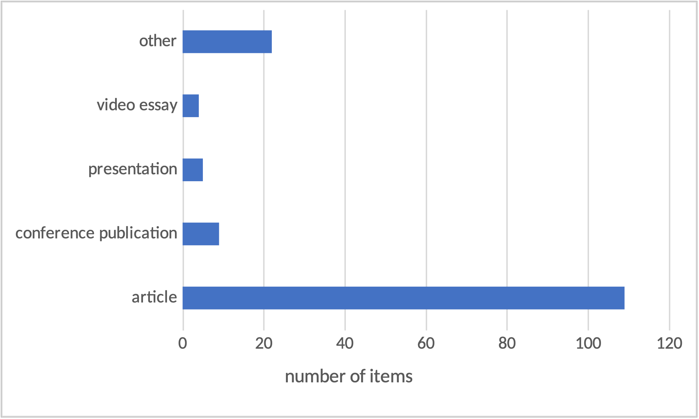

## Introduction

In the first year since the beta launch of the HSS Commons, members have added over one hundred publications and the features of the repository’s design are beginning to manifest. The potential for connections across projects, scholars, and within the community is a central promise of the HSS Commons, embodied both in its social networking features and through serendipitous discovery of uploaded works (Martin 2022). This latter potential—the possibility that one can stumble upon relevant and inspiring research—is enabled through specific design choices in the platform.

Among some scholarly communities, such as historians, there is a well-known and explicit attunement to the importance of serendipity in the research process (Dalton and Charnigo 2017; Martin and Quan-Haase 2017), drawing attention to particular features of item metadata and its effect on browsing (Watson and Bullard 2022). In following Martin’s focus on the potential for serendipity in the Commons and the centrality of metadata to enabling that mode of discovery and connection, I examine the metadata attached to the first 149 items added to the HSS Commons (as of October 2022). Of particular focus is the descriptive metadata, including tags, publication types, and relationships among items. As a user-generated collection, the Commons relies on uploaders (typically the authors or creators of the publication items) to enter the metadata that will serve to identify, define, and make findable the items themselves.

At the time of this study, the HSS Commons is in beta, with early adopters within the community establishing the content and tone of the repository and its social features in line with and on top of technical design choices already implemented. Peers within INKE have described the design and intent of the Commons (Arbuckle et al. 2021) and its ongoing development (Jensen 2023). Here I focus on author-supplied metadata meant to facilitate serendipitous discovery of items. Uploaders contribute metadata for an item that helps identify and refer to the item, such as title and abstract, and metadata that indicates its connections to other items as links, like author names and keywords (labelled in the Commons as “tags”). On the homepage of the Commons, a short selection of tags composes the entry point of the “browse” feature, as shown in Figure 1.

Information studies supplies some predictions of the shape of author-supplied metadata (Gross, Taylor, and Joudrey 2015; Munk and Mørk 2007; Schwing, McCutcheon, and Maurer 2012), including different views on the intent and operation of fields, a tendency towards very high-level or general terminology, and the relevance of interaction design choices. This paper shares findings on the metadata practices already visible in the HSS Commons and suggest some topics for further discussion and engagement on how repositories can direct members to informed choices in creating metadata for their works.

## Literature Review

My analysis of the aggregate metadata of the Commons is informed by my work in library and information studies. Information studies has a complex relationship with user-generated metadata and with folksonomies of keywords. I characterize the scholarly assessment of folksonomies as belonging to one of three broad camps:

1.  folksonomies are a barely-sufficient attempt at subject indexing that is only appropriate to navigate user-generated collections where at-scale professional indexing is not economically attainable (Golder and Huberman 2006; Peterson 2006; Sen et al. 2007);

2.  folksonomies are an expression of the language and priorities of a community, organically expressed through the aggregate choices of many hundreds, thousands, and millions of users, including those belonging to minority communities made marginal by top-down systems instantiating the views of the historically powerful (Adler 2013; Lau 2008; Mai 2011); and therefore,

3. folksonomies are a good complement to top-down vocabularies in that they help to fill in gaps caused by biases shared among professional indexers and by lagging currency of controlled vocabularies (Dotsika 2009; Golub, Lykke, and Tudhope 2014; Syn and Spring 2013).

The key studies establishing phenomena of tagging behaviour and the characteristics of folksonomies found that the aggregate of many users’ independent actions quickly reach stable patterns (Golder and Huberman 2006) following a predictable power law where a few tags (and a few users) represent most of the activity on the platform (Munk and Mørk 2007). These studies established that interface features such as listing other users’ applied tags or suggesting them in autocomplete functions accelerates imitation and convergence to general rather than specific concepts. These studies (and others establishing the basic dynamics of folksonomies) addressed collections in which users (typically, readers and consumers of the tagged items) applied tags to items, with fewer analyses comparing terms applied by authors, users, and professional indexers (Kipp 2011). Authors or creators have a meaningfully distinct orientation to their items and apply different priorities and expertise to tag choice, and these differences in priority and perspective are likely to bear out in organizing and labelling actions (Holstrom 2019).

Aggregate collections of author-supplied keywords can serve as proxies for the content of whole disciplines, allowing researchers to measure and track the development of sub-disciplines (Dirrigl Jr and White 2022; Onyancha 2018). Such large-scale analyses of scholarly publications’ topics complement network analysis of authorship, collaboration, and citation which seek to generate findings about the dynamics within or across disciplines (Deng and Xia 2020; González-Teruel et al. 2015). A different set of analyses asks not what we can learn about items from these keywords but returns to their primary intention: how are they contributing to discoverability of items, especially in comparison to professional subject indexing? In comparing the utility of author-supplied keywords and professionally applied terms from controlled vocabularies, scholars have found a tendency for unique terms in each set, complementing utility in retrieval (Schwing, McCutcheon, and Maurer 2012; Strader 2011); scholars also found that broad disciplines have dynamics distinct from other broad disciplines (Maurer and Shakeri 2016). Where author-supplied keywords differ most from library workers’ application of controlled vocabulary terms is that the former is more likely to have repetition or redundancy with other fields in the record, such as the item’s title (Gross, Taylor, and Joudrey 2015).

Following prior work on the study of aggregate keywords in repositories, I ask whether the HSS Commons metadata aligns to known tendencies in user-applied keywords? Specifically,

1.  Within items, is there evidence of redundancy in use of general and specific terms and repetition of terms found in other fields?

2.  Does the aggregate metadata show convergence on generic terms and synonyms of consistent concepts?

## Methods

The full corpus of public uploads to the HSS Commons can be accessed through the site’s browse functionality.[^1] The raw format for all items is also available through the OAI-PMH protocol.[^2] Using this output, I downloaded the metadata for all publications as XML on October 7, 2022. The XML dataset includes the following attributes:

-   Title
-   Creator(s)
-   Description
-   Subjects (shown in the HSS Commons view as “Tags”)
-   Version \#
-   Date Added to HSS Commons
-   Unique identifier (typically a DOI or HSS Commons url)
-   Publication type (e.g., Article, Presentation, Video Essay)
-   Related items (e.g., Version 2.0)

This analysis focuses on the first 4 attributes (title, creator, description, and subjects). Not included in this dataset is the “notes” field, which typically includes information on the original publication, if relevant, and original citation, as in Figure 2.

I imported the XML dataset into Open Refine,[^3] open-source software for parsing datasets. Though Open Refine can be used to transform and clean data, here I used it only for analysis, such as summarizing values in particular fields, comparing text strings within and across fields, and reviewing its algorithm’s suggestions for normalizing variant expressions (e.g., plural forms and misspellings). Open Refine is particularly useful for parsing fields with repeatable values (such as Creator) while preserving the connection to a single record. The results in the following section reflect a number of calculations done on repeatable values across records (here, items). I first summarize the features of the dataset as a representation of the HSS Commons corpus, and then share the results of some analysis of key features of the descriptive metadata.

## Results

### Summary of metadata records

At the time of export, the HSS Commons included 149 publications. The vast majority of these were “articles” with a long tail of other publication types, as shown in Figure 3. Adjusting the dataset to parse values in the “creator” field, there are 128 unique text strings for authors across the 149 items.

There is substantially more variation among the use of tags (here, subjects) across items. Most items (124/149, 83%) had at least one subject listed. Among the twenty-five items without subjects, one was an obvious “test” upload with minimal metadata using placeholder text and no public version. Items including at least one subject had an average of four subjects listed. The distribution of number of subjects applied, ranging from one to 12, is illustrated in Figure 4.

There are a total of 295 unique strings among applied subjects. The top ten subject strings (3% of total) by frequency account for 1/4 (26%) of all subjects applied across items. The distribution of these top ten subject strings are shown in Figure 5. The most commonly occurring subject string, “digital humanities” appears seven times as the only subject on an item.

### Semantic Variation

In addition to other forms of variation across all the subjects applied to items, such as their literal meaning and their language of expression, there are different types of relationships between subjects and their items. For example, items tagged “open scholarship” are themselves instances of open scholarship, being accessible through the HSS Commons to all users. Only some items tagged “open scholarship” are *about* the open access phenomenon and report and describe instances of such. Similarly, some items tagged “digital humanities” are about the discipline, while others are exemplars of the discipline. In other words, some subject–item relationships indicate *aboutness* while others indicate *is-ness*.

### Data Quality and Redundancy

In the aggregate view, there are minimal obvious issues with data quality. There are some clear typos among subject fields, such as “scholarly pyblishing,” detectable using Open Refine’s clustering algorithms. There are also detectable variations in data input, including two unique creators entered in different items as “Surname, GivenName” and “GivenName Surname” order.

Focusing on the most commonly applied subjects (Figure 5), we can see some redundancy in applying near-synonymous keywords within the same item. For example, among the 23 items tagged with “open scholarship,” ten are also tagged with “open access” and nine with “open social scholarship.” Similar patterns occur with less frequently applied tags, such as “Public Knowledge Project” and its initialism “pkp” appearing as tags on the same item. There is also some variation in tagging items with terms for specific concepts and tagging for more generic or atomized elements of a combined concept, shown through the presence of the term “open” in addition to “open science,” “open scholarship,” and similar terms. Of particular relevance for the *Canadian* HSS Commons is redundancy by way of bilingualism. Though not easily identified using these computer-assisted methods, there is an observable practice within the corpus for entering French tags equivalent to the English tags, such as “dynamic edition” and “édition dynamique” appearing on the same item.

Computer-assisted methods make it possible to measure the extent of redundancy between subject strings and other metadata elements. For context, the search function[^4] will return results when the entered term(s) appear in any of subject, title, creator, or description fields. Of the 531 instances of subjects applied to items, 63 (12%) are identical to term strings included in the item’s title; 96 (18%) are identical to term strings included in item’s description. Due to overlap (some term strings occurring in a single item’s subject string, title, and description), 110 (21%) subjects overlap with term strings in the item’s title and/or description. Some items had multiple subjects overlapping with the title and/or description, so these do not represent 110 items. A total of 64 (52%) of items with at least one subject had one of those subjects duplicated in the title and/or description.

## Discussion & Design implications

Exploring the current state of HSS Commons metadata reveals that the aggregate author-supplied keywords enact familiar dynamics from established studies of user tagging behaviour. The most obvious alignment is in the proportion of redundant tags as compared to those observed in a large corpus from the ACM Digital Library (Lu et al. 2020). The authors found that 56% of author keywords appeared in either the abstract or the title of the item; this analysis found 52%. Where each of these fields is author-defined, with no constraints on eligible vocabulary, it is natural that authors would use similar phrases and terms in all fields. This consistency *within* items contributes to the lack of consistency *across* items. Synonymous terms in the full set of subjects occur because authors have chosen their own ways of expressing concepts; the concepts are points of connection across the scholars though the exact term strings are not as reliably so. Some authors have anticipated the system’s failure to capture this connection and have used multiple variations of term strings for shared concepts on a single item, even in multiple languages.

Also matching expected dynamics of folksonomies, there is already an observable power law in the distribution of subjects applied across the corpus, with the top 3% of tags accounting for 26% of all tags applied. This distribution and the tags in the top 3% aligns with earlier studies that suggest analyzing author-supplied keywords is a reliable method to quickly summarize the breadth and variety of a repository or a field (Dirrigl Jr and White 2022; Onyancha 2018). The INKE partnership being a driver for early adopters toward the HSS Commons means that many of the beta items are simultaneously *about* open scholarship while also *exemplifying* open scholarship practices through this public access. This frequency distribution, over time, will be an indicator of whether the HSS Commons represents Canadian humanities and social science beyond the core of INKE.

Observing these dynamics within the HSS Commons tells us something about the content of the repository and the behaviour of its users but it also suggests possible interventions into tagging practices. Reducing variations in expressing shared concepts can improve the potential of the repository to support serendipitous discovery. However, all interventions create friction elsewhere, either in the process of authors uploading their own items or in maintenance of the repository itself. In considering these options, the key question is, what is the HSS Commons meant to be? A friction-free (or friction-low) platform for creators to upload their work for access? A place to foster connection and serendipity across those works? A representation of the values and aspirations of its community? All have different implications for where labour and effort should be expended and which interactions should be effortless, leading to particular decisions about design and maintenance.

If the repository prioritizes users’ creativity and their expression of domain expertise, control or standardization of terminology is an inappropriate intervention. Controlled vocabularies, such as the Library of Congress Subject Headings applied to monographs, reduce synonymity and increase linkages across items, but do so by limiting choice to predefined term strings that require substantial labour and commitment to revise (Baron and Gross 2021) and can be out of step with disciplinary discourse and ethics (Bullard, Watson, and Purdome 2022). Their use also tends to add procedural load to the submission process, which needs to stay accessible to allow the repository to grow to a critical mass.

Collections that prioritize user creativity and self-expression tend not to apply controlled vocabularies but may reduce fractured synonymity through more subtle nudges, like autocomplete (Holstrom 2020), or through the use of curated folksonomies (Bullard 2019). The latter is itself a major commitment to both the architecture of the database and in ongoing labour to review unique tag strings for potential synonymity with existing tags. Smaller nudges, like autocomplete, have a less burdensome requirement of the database architecture and tend to speed user choices in addition to reducing simple synonymity such as typos. The autocomplete feature currently implemented in the HSS Commons is likely preventing more misspellings than were found in this analysis, but it is limited in its impact to terms already spelled correctly in the corpus. Misspellings detected through tools like Open Refine could be edited by site administrators, though it would be appropriate to prompt corresponding authors to confirm the change rather than risk overriding users’ creative freedom.

The strongest argument for some form of data maintenance with regards to tags in the HSS Commons is supporting multilingualism. Even if there is no justification for creating a controlled vocabulary, mapping between English and French tags would enable more exhaustive keyword searches and minimize findability gaps between researchers with more or less exhaustive multilingual tagging practices. One barrier to such a mapping is technological and depends on whether the database and indexing architecture of the Commons allows for tags to invisibly map to others, so that, for example, the tag page for “ecocritique”[^5] would also list items tagged “ecocriticism.” A second barrier has to do with the labour and imperfection of translation. While it may be possible to create French–English equivalents to new tags on a routine basis (for example, every six months, depending on the speed of growth of the Commons tag set), it would be best to do so manually, by workers with not just bilingual fluency but enough domain expertise relevant to the tagged items to discern whether two terms are equivalent not just in composition but in academic nuance.

## Conclusion

The HSS Commons’s potential to foster connections and discovery, in addition to enabling access to open scholarship, can be facilitated through particular design decisions around the handling of item metadata. This initial analysis has shown that largely self-directed behaviours among the early uploads to the repository align to expected dynamics of user-supplied metadata. While this paper has introduced possible interventions that align to the community’s goals, the repository and its metadata exist in a larger scholarly ecosystem that affects these choices. New networked catalogues such as Open Alex[^6] ingest metadata from repositories like the HSS Commons and can support discovery of the latter’s items through external tools. Existing descriptive practices such as controlled vocabularies applied to journal and conference papers will themselves be ingested into the HSS Commons metadata, either through authors habitually conforming to their vocabulary for keywords or more directly when item metadata is copied from an original publication record. Within this larger ecosystem of scholarly publishing and discovery, awareness of and intentional choices regarding metadata work within the HSS Commons are one pathway among many that the practices of this community can align with its vision for collaboration and connection.

## References

Adler, Melissa. 2013. “Gender Expression in a Small World: Social Tagging of Transgender-Themed Books.” *Proceedings of the American Society for Information Science and Technology* 50 (1): 1–8. [https://doi.org/10.1002/meet.14505001081](https://doi.org/10.1002/meet.14505001081).

Arbuckle, Alyssa, Graham Jensen, Luis Meneses, Ray Siemens, and Caroline Winter. 2021. “Reimagining the Digital Research Commons for the Canadian HSS Community.” *Canadian Society for Digital Humanities (CSDH/SCHN) 2021*. [https://hcommons.org/deposits/item/hc:38809/](https://hcommons.org/deposits/item/hc:38809/).

Baron, Jill, and Tina Gross. 2021. “Sorrow, Fury, Helplessness, and Cynicism: An Account of the Library of Congress Subject Heading ‘Illegal Aliens.’” *Dartmouth Library Staff Publications*. [https://digitalcommons.dartmouth.edu/dlstaffpubs/34](https://digitalcommons.dartmouth.edu/dlstaffpubs/34).

Bullard, Julia. 2019. “Curated Folksonomies: Three Implementations of Structure through Human Judgment.” *Knowledge Organization* 45 (8): 643–52. [https://doi.org/10.5771/0943-7444-2018-8-643](https://doi.org/10.5771/0943-7444-2018-8-643).

Bullard, Julia, Brian Watson, and Caitlin Purdome. 2022. “Misrepresentation in the Surrogate: Author Critiques of ‘Indians of North America’ Subject Headings.” *Cataloging & Classification Quarterly* 60 (6–7): 599–619. [https://doi.org/10.1080/01639374.2022.2090039](https://doi.org/10.1080/01639374.2022.2090039).

Dalton, Margaret Stieg, and Laurie Charnigo. 2017. “Historians and Their Information Sources \| Dalton \| College & Research Libraries.” *College and Research Libraries* 60 (5): 400–25. [https://doi.org/10.5860/crl.65.5.400](https://doi.org/10.5860/crl.65.5.400).

Deng, Shengli, and Sudi Xia. 2020. “Mapping the Interdisciplinarity in Information Behavior Research: A Quantitative Study Using Diversity Measure and Co-Occurrence Analysis.” *Scientometrics* 124 (1): 489–513. [https://doi.org/10.1007/s11192-020-03465-x](https://doi.org/10.1007/s11192-020-03465-x).

Dirrigl Jr, Frank J., and Justin White. 2022. “The Use of Keywords in Archaeornithology Literature.” *International Journal of Osteoarchaeology*. [https://doi.org/10.1002/oa.3182](https://doi.org/10.1002/oa.3182).

Dotsika, Fefie. 2009. “Uniting Formal and Informal Descriptive Power: Reconciling Ontologies with Folksonomies.” *International Journal of Information Management* 29 (5): 407–15. [https://doi.org/10.1016/j.ijinfomgt.2009.02.002](https://doi.org/10.1016/j.ijinfomgt.2009.02.002).

Golder, Sa, and Ba Huberman. 2006. “Usage Patterns of Collaborative Tagging Systems.” *Journal of Information Science* 32: 198–208. [https://doi.org/10.1177/0165551506062337](https://doi.org/10.1177/0165551506062337).

Golub, Koraljka, Marianne Lykke, and Douglas Tudhope. 2014. “Enhancing Social Tagging with Automated Keywords from the Dewey Decimal Classification.” *Journal of Documentation* 70 (5): 801–28. [https://doi.org/10.1108/JD-05-2013-0056](https://doi.org/10.1108/JD-05-2013-0056).

González-Teruel, Aurora, Gregorio González-Alcaide, Maite Barrios, and María-Francisca Abad-García. 2015. “Mapping Recent Information Behavior Research: An Analysis of Co-Authorship and Co-Citation Networks.” *Scientometrics* 103 (2): 687–705. [https://doi.org/10.1007/s11192-015-1548-z](https://doi.org/10.1007/s11192-015-1548-z).

Gross, Tina, Arlene G. Taylor, and Daniel N. Joudrey. 2015. “Still a Lot to Lose: The Role of Controlled Vocabulary in Keyword Searching.” *Cataloging & Classification Quarterly* 53 (1): 1–39. [https://doi.org/10.1080/01639374.2014.917447](https://doi.org/10.1080/01639374.2014.917447).

Holstrom, Chris. 2019. “Moving Towards an Actor-Based Model for Subject Indexing.” *NASKO*, 120–28. [https://doi.org/10.7152/nasko.v7i1.15631](https://doi.org/10.7152/nasko.v7i1.15631).

———. 2020. “The Effects of Suggested Tags and Autocomplete Features on Social Tagging Behaviors.” *Proceedings of the Association for Information Science and Technology* 57 (1). [https://doi.org/10.1002/pra2.263](https://doi.org/10.1002/pra2.263).

Jensen, Graham. 2023. “Connecting Researchers and Research Communities: (Re)Introducing the Canadian Humanities and Social Sciences Commons.” In *Reviewing, Revising, and Refining Open Social Scholarship: Canada*. Victoria, BC.

Kipp, Margaret E. I. 2011. “Tagging of Biomedical Articles on CiteULike: A Comparison of User, Author and Professional Indexing.” *Knowledge Organization* 38 (3): 245–61.

Lau, Andrew J. 2008. “Burning Down the Shelf: Standardized, Classification, Folksonomies, and Ontological Politics.” *InterActions: UCLA Journal of Education & Information Studies* 4 (1): 1–12. [https://doi.org/10.5070/D441000621](https://doi.org/10.5070/D441000621)

Lu, Wei, Zhifeng Liu, Yong Huang, Yi Bu, Xin Li, and Qikai Cheng. 2020. “How Do Authors Select Keywords? A Preliminary Study of Author Keyword Selection Behavior.” *Journal of Informetrics* 14 (4). [https://doi.org/10.1016/j.joi.2020.101066](https://doi.org/10.1016/j.joi.2020.101066).

Mai, Jens-Erik. 2011. “Folksonomies and the New Order: Authority in the Digital Disorder.” *Knowledge Organization* 38 (2): 114–22.

Martin, Kim. 2022. “Finding Common Ground: Cultivating Serendipity in the HSS Commons.” In *Launching a Digital Commons for the Humanities and Social Sciences*. [https://doi.org/10.25547/SH5H-1J24](https://doi.org/10.25547/SH5H-1J24).

Martin, Kim, and Anabel Quan-Haase. 2017. “‘A Process of Controlled Serendipity’: An Exploratory Study of Historians’ and Digital Historians’ Experiences of Serendipity in Digital Environments.” *Proceedings of the Association for Information Science and Technology* 54 (1): 289–97. [https://doi.org/10.1002/pra2.2017.14505401032](https://doi.org/10.1002/pra2.2017.14505401032).

Maurer, Margaret Beecher, and Shadi Shakeri. 2016. “Disciplinary Differences: LCSH and Keyword Assignment for ETDs from Different Disciplines.” *Cataloging & Classification Quarterly* 54 (4): 213–43. [https://doi.org/10.1080/01639374.2016.1141133](https://doi.org/10.1080/01639374.2016.1141133).

Munk, T Bisgaard, and Kristian Mørk. 2007. “Folksonomy, the Power Law & the Significance of the Least Effort.” *Knowledge Organization* 34 (1): 16–33.

Onyancha, Omwoyo Bosire. 2018. “Forty-Five Years of LIS Research Evolution, 1971-2015: An Informetrics Study of the Author-Supplied Keywords.” *Publishing Research Quarterly* 34 (3): 456–70. [https://doi.org/10.1007/s12109-018-9590-3](https://doi.org/10.1007/s12109-018-9590-3).

Peterson, Elaine. 2006. “Beneath the Metadata: Some Philosophical Problems with Folksonomy.” *D-Lib Magazine* 12 (11). [https://doi.org/10.1045/november2006-peterson](https://doi.org/10.1045/november2006-peterson).

Schwing, Theda, Sevim McCutcheon, and Margaret Beecher Maurer. 2012. “Uniqueness Matters: Author-Supplied Keywords and LCSH in the Library Catalog.” *Cataloging & Classification Quarterly* 50 (8): 903–28. [https://doi.org/10.1080/01639374.2012.703164](https://doi.org/10.1080/01639374.2012.703164).

Sen, Shilad, F. Maxwell Harper, Adam LaPitz, and John Riedl. 2007. “The Quest for Quality Tags.” In *Proceedings of the 2007 International ACM Conference on Conference on Supporting Group Work - GROUP ’07*, 361. New York: ACM Press. [https://doi.org/10.1145/1316624.1316678](https://doi.org/10.1145/1316624.1316678).

Strader, C. Rockelle. 2011. “Author-Assigned Keywords versus Library of Congress Subject Headings.” *Library Resources & Technical Services* 53 (4): 243–50. [https://doi.org/10.5860/lrts.53n4.243](https://doi.org/10.5860/lrts.53n4.243).

Syn, SY, and MB Spring. 2013. “Finding Subject Terms for Classificatory Metadata from User-Generated Social Tags.” *Journal of the American Society for Information Science and Technology* 64 (5): 964–80. [https://doi.org/10.1002/asi.22804](https://doi.org/10.1002/asi.22804).

Watson, Brian M., and Julia Bullard. 2022. “‘I’m Really Happy When Sometimes I End up on a Shelf That Seems Sort of Right:’ Historians’ Reactions to the Cataloging and Classification of Their Own Work.” *Proceedings of the Association for Information Science and Technology* 59 (1): 335–45. [https://doi.org/10.1002/pra2.757](https://doi.org/10.1002/pra2.757).

[^1]: https://hsscommons.ca/publications/browse

[^2]: https://hsscommons.ca/oaipmh?verb=ListRecords&amp;metadataPrefix=oai_dc

[^3]: https://github.com/OpenRefine/OpenRefine

[^4]: https://hsscommons.ca/search/

[^5]: https://hsscommons.ca/tags/ecocritique

[^6]: https://docs.openalex.org/

