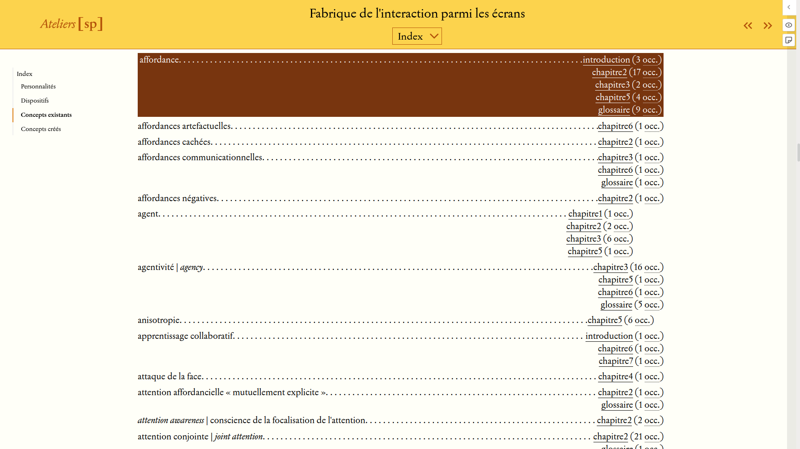

## Introduction

Building academic publishing toolchains is not an easy task, especially if the goal is to produce interesting artefacts with clean reading interfaces for a great reading experience. Academic monographs can be incredibly useful as digital objects to allow for easy navigation. Through these digital objects we can engage with texts, but also with images, bibliographical data, videos, various data, and visualizations. Most often, digital monographs are available in PDF format, which is useful—and often essential due to the publishing process—but it is still traditionally not the final product of the book—the printed edition is. As an alternative to PDFs, web interfaces are interesting and a more malleable way to disseminate content, but they also have their drawbacks.

Academic digital publishing is a complex process, and there are major constraints to deal with and consider. It is about text specificities: rich metadata, text structuring, critical materials (such as footnotes, figures, citations and bibliographies), file format requirements (such as complex XML) for digital platforms, etc. As academics already know, an academic book is not just about text—and even text is not just about text (DeRose et al. 1990).

Workflows in academic publishing have been adopted from traditional practices from the time when the paper was the only way to share scientific content. As academic publishing has increased in complexity, so have the workflows. But it is necessary to create new ways to produce and share academic content—even if we require a paginated format, such as PDF. Since the beginning of digital publishing, a lot of initiatives have tried to find a solution—primarily using some kind of web interface. However, it is about building complicated cathedrals.

It is time to find a way to produce printable artefacts associated with enriched digital versions, and to build experimental environments for new epistemological models. With one publishing series and one press, we had the opportunity to conceive of a toolchain without only a print edition in mind, but rather with several digital output formats—even those we did not know of yet. The challenge was to write and edit digital (and printed books in mind for the future) without having the concept of the traditional printed page in mind.

## What About Digital Principles?

It is not easy to enumerate the digital principles that are new paradigms compared to publishing analogue artefacts. The academic conversation on the topic of digital production of scientific documents touches on many aspects of the publishing process that other researchers are working on. For example, the INKE partnership project has been working on the intersections between social networking technologies and scientific publications (Siemens et al. 2012; Crompton et al. 2013; Jesperson et al. 2022). Others, like John Maxwell, also focus on publication procedures including peer review (Maxwell 2022). The Revue2.0 project, led by the Canada Research Chair on Digital Textualities from 2018 to 2021, was also an investigation on how academic journals build knowledge and show the richness of the multiplicity of academic publishing practices (Fauchié et al. 2020). However, other aspects relevant to the implementation of publishing toolchains will be explored in this article: multimodal publishing, modularity, minimal computing, and progressive enhancement. Regarding this theoretical section, our reflections are mostly inspired by Jay David Bolter (2001) and Christian Vandendorpe (1999). These two authors suggest the idea of a long evolution, without sharp ruptures.

> If the printing press was the classic writing machine, the computer constitutes a technology of writing beyond mechanization, a postindustrial form of writing. (Bolter 2001, 15)

> Under hypertext, in fact, writing is no longer governed by surface relationships but by depth. (Vandendorpe 1999, 184)

Multimodal publishing is the capacity to produce multiple different artefacts with the same editorial effort and from a single input source. Output formats such as PDF, XML, or EPUB are necessary for publishing today, especially in the academic field, and some journals also opt for an additional web version wherein editors can freely put some extra content and data. The flexibility of a web interface makes it possible to shape the reading experience, and to play with it. With the multimodal, single-source approach it is possible to produce a PDF for printing, an XML export for a digital platform, and a digital version in HTML format, all from one source file.

Many organizations have attempted to build monolithic publishing platforms—monolithic in the sense that the systems or platforms have complex engineering, so much so that adding functionalities requires particularly advanced development knowledge. The balance between creating a powerful publishing toolchain and maintaining the opportunity to intervene is hard to find. Manifold, PubPub, Omeka/Omeka S, and Pressbooks are some possible solutions to the need to produce quality digital publications. These digital platforms, especially Omeka/Omeka S, have a modular structure and offer an extension function—plugins can be installed for specific features or tasks. Rather than implementing complex workflows in one single application, modular systems offer the ability to build and use multiple editorial templates in the same chain. From a single source, it is possible to apply few templates for different outputs. Additionally, it entails building a system that can be understood by people with some basic programming abilities, as may be the case for some digital humanists. Each feature is represented by a specific module in a relatively comprehensive programming language like Python, so it is possible to add units or packages for new functionalities, which allows users to experiment with these tools. This is what a *modular factory* can be. Why *factory* and not toolchain, system, or forge? Toolchain involves linking stages together in a linear way, without the possibility to improve two separate steps at the same time; system implies a process that is closed in on itself with a dimension of essentialization of its functions or components; and forge introduces ambiguity between chain creation and content creation. The term *factory* come from Vilém Flusser:

> Factories are places in which new kinds of human beings are always being produced: first the hand-man, then the tool-man, then the machine-man, and finally the robot-man. To repeat: This is the story of humankind. (Flusser 1999, 44–45)

In the specific field of digital humanities, a powerful concept can be used for shaping a publishing toolchain: *minimal computing*. In a few words, minimal computing “advocates for using only the technologies that are necessary and sufficient for developing digital humanities scholarship in such constrained environments” (Risam and Gil 2022). Alex Gil developed these principles in ten points when he described Ed, a tool for publishing (Gil 2019): control, energy, bandwith and data, the internet, the maintainers, the readers, the learners, the editors, financial, and preservation. These principles—or at least some of them—can be used for building a sustainable publishing *factory*. We can highlight three of them that seems relevant for our purposes: control, editors, and preservation.

-   Control: the ability to change the way the publishing toolchain works.

-   Editors: all the people involved in the publishing project must understand how it works.

-   Preservation: being able to read and modify the text sources and generate the output formats.

The last digital principle we want to explain is the progressive enhancement. In the case of digital tools and platforms, it is easier to start small and increase the number and quality of the features later on. For example, we can start with just a web version and a printable-PDF version. Other formats like XML or EPUB can be added in future. If the factory is modular, it is possible to add new modules for new functions such as a new output format and experiment with it.

We started by describing these principles, and now we have to explain how they inspired a publishing project in academic field.

## The Case of a University Press

In 2014 the first book of a new series of the Presses de l’Université de Montréal was published: *Pratiques de l’édition numérique* (*Digital Publishing Practices*), edited by Michael Sinatra and Marcello Vitali-Rosati. It is about digital humanities and editorial challenges of producing digital content. This book was available in a classic printed version—in a pocket format with a graphic visual cover—and in a few digital formats: EPUB and PDF produced by the publisher, but also as a web and enriched version published by the editors of the series. The new series is called “Parcours numériques” (“Digital Paths”). The editors of the series wanted to find a way to share the enriched content so the series is available in a hybrid open access model: the web (and enriched) version is free to read online, the PDF and the EPUB files are free to download, and the printed version is available for purchase. The goal is to widely distribute content about digital practices for students and professors, and for creators and researchers.

This opportunity—thanks to the Presses de l’Université de Montréal for being curious and innovative—to build a new digital publishing process came with a lot of questions: which platforms to choose? how to integrate enriched content? how to make these digital objects last? who can integrate the content? what is the relation with the classical workflow of the publisher?

In 2014 the first strategy was to use a content management system (CMS) for building the web version. A CMS integrates several functions at the same time: a text editor (with a WYSIWYG interface[^1]), an HTML builder, a template engine for structuring the web pages, and a graphical interface for writing and organizing contents. We chose to use SPIP (*Système de publication pour l'Internet*) for three main reasons: it is lightweight as a CMS, it is easy to use and was relatively flexible at the beginning of the 2010s (created in 2001), and because SPIP came from a certain digital culture and was used and developed as much by academics as by newspapers. SPIP has its own markup language for writing and has similar features to the well-known WordPress.

Figure 1 shows what an article would look like on the SPIP system. Features to note include: the top centre shows the text with few classic metadata; the main screen shows the body of the article; the top left shows some useful navigational tools; the center left shows footnotes and additional notes; and the bottom left shows enriched content, such as a Zotero bibliography or few additional links.

The editors used this solution to publish ten books in the first six years. For each book, the publisher, Presses de l’Université de Montréal, produced the print and EPUB editions, and the editors produced the web and enriched version. Quite quickly certain limits were encountered:

-   SPIP required PHP updates, and it was not easy to update all the books;

-   the same platform was used for all of the books, but it was important to make each book project independent;

-   enriched content was not sufficiently displayed;

-   the ability to work collectively on a CMS was not so practical as we needed to be able to track changes;

-   other publishing experiences tested a lightweight markup language, which seemed interesting to work with;

-   the reading interface needed an update and a mobile adaptation; and

-   experimentation with new and multiple editorial templates was a strong need, the *hacking* was necessary.

For all of these reasons, the editors built a new platform, modular, scalable and experimental by design.

Le Pressoir was designed to address these challenges, a publishing toolchain based on the converter Pandoc. With the experience of Stylo (Vitali-Rosati et al. 2020), three languages, a converter, and a programming language were included in the platform. Before explaining the technological stack, it is very important to stress two points: the tools were not chosen for their performance, but because they allow users to experiment and to try new epistemological models; and most of these elements are not created, developed, and maintained by private for-profit companies—for example Pandoc was designed by a philosopher, John MacFarlane. It is a necessity to be able to build tools, and to hack with them, even if it means giving up a certain form of professionalism promoted by the classic tools. Markdown is a lightweight markup language for writing, YAML is a data-serialization language for describing the metadata, and BibTeX is bibliographical description language for structuring the bibliographical data (BibTeX was originally used with LaTeX, the software system for document composition). These three formats are all we need for writing and editing, but we also need to convert the content into different formats such as HTML. Pandoc is a powerful converter; it is able to convert Markdown (with YAML for the metadata description and BibTeX for the structured bibliographical data) into a web page (or any other format) with excellent handling of structured contents. To organize the different web pages, we needed some scripts. We chose to use Python because it is a powerful programming language and it is widely used in the digital humanities field, and the team involved had knowledge of this language. David Larlet, a designer and programmer, worked on the scripts and made Le Pressoir, a factory with the following features: a clear structure (book, chapters, indexes, glossaries, etc.); a conversion from Markdown files (with YAML and BibTeX files for the metadata and the bibliographical references) to HTML based on Pandoc; a manager of enriched content such as different types of media, indexes, and glossaries; the organization of different pages through website navigation tools; etc.

Figure 2 shows what an article looks like in the Le Pressoir factory system. Features to note include: the top of the page has a few navigation tools, such as the menu of chapters, links to previous/next chapters, and a link to the book list of the series; the left sidebar shows the navigational menu for the chapter; and the center of the page shows the text and the enriched content with a “+” sign as a way to find out information about indexed items (people, places, or subjects), and clickable bibliographical references.

Working with Pandoc and Python was a great experience, because Pandoc is an awesome program—its operation is based on easy-to-use options and arguments, and its conversion options are numerous—and because Python made it possible to implement different and elegant methods to do complex things in a relatively accessible way. Python is a widely used programming language, and it offers convenient prototyping environments like Jupyter Notebook. This use case is centered on the use of web technologies and content enrichment, but it is planned to produce other formats with the same factory, including a printable PDF and an EPUB version.

We can look at the architecture of content and additional documents to illustrate the flexibility offered by Le Pressoir in the production of the books. For example, the chapters that make up the books are not integrated one after the other in a file, but are structured explicitly and thoughtfully, in line with the intended meaning of the subject. Thus, there is a double structure: the first is that of Le Pressoir and the paths it must follow to build the book; the second is that described in the book’s metadata when building the table of contents. An editorial choice has to be made at this point, and content can be distributed as desired, while respecting the specificities imposed by the YAML (serialization) format. Similarly, what we refer to as “additional content” is not just media in the sense of images or videos, but all objects that may exist on the web. Each piece of added content is given a precise description in the serialization format (YAML) and includes all its metadata, which can then be transformed by Le Pressoir.

## The Case of a New Series/Publisher

During the reshaping of the toolchain, another project benefitted from this reflection: the Ateliers de \[sens public\],[^2] a series that is a spin-off from the journal *Sens public*.[^3] The Ateliers publish monographs, the first of which were: *Facebook* by Gérard Wormser, *L’espace numérique* by Éric Méchoulan and Marcello Vitali-Rosati, *Exigeons de meilleures bibliothèques* by R. David Lankes, a collective book named *Fabrique de l’interaction parmi les écrans* and *Lire Nietzsche à coups de sacoche* by Mélissa Thériault. Created by Servanne Monjour, Nicolas Sauret, and Marcello Vitali-Rosati, the Ateliers is a more complete use case of the toolchain, because in this case the web version, a printable PDF, a lightweight PDF, and an EPUB must be produced. During 2020 and 2021, both Parcours numériques and the Ateliers were the use cases for the creation of the new factory.

The contribution of the Ateliers was mainly to allow a lot of freedom for editorial modeling and to produce new use cases for the enriched content. We have also confirmed the use of a version control system to manage the source (Git) and the use of the GitLab platform (on the instance of the french infrastructure Huma-Num). It is out of the scope of this paper to explain how Git works, nevertheless, we want emphasize one of its most interesting features: the branch. It is possible to create a copy of the project and work on different parts of it (linguistic revision, testing for a new feature of the web version, addition of some enriched content, etc.). This is very useful for working with different people having diverse skills, like students, because it is not really possible to break the factory and the books. They can test what they want, look at different modifications, open annotations on the projects, etc. without worrying about breaking the original instance. Once all the modifications have been made, the branches we approve can be merged with the main version of the project.

Figures 3 and 4 show what an *Ateliers* article looks like on the Le Pressoir factory system. The main layout of the article in Figure 3 is similar to that of the “pratiques de l’édition numérique” article shown in Figure 2. Figure 4 shows the organized layout of the indexing system. The index gathers all the terms that are tagged by the editor, and for each term there are two important pieces of information: the place(s) we can find that term and the number of occurrences for each place/chapter. When you click on a term from a chapter, the index page highlights the word or expression.

The development of Le Pressoir was possible thanks to a few conditions. The technical issues—such as the development of the workflow and the creation of new features—were not the most complex problems to solve. Each new book is an opportunity to experiment and overcome new challenges. The independent editor Hélène Beauchef has been collaborating with the Parcours numériques and the Ateliers teams for several years, both on content and in the constitution of the toolchain. She is able to understand the needs of the authors and to express them in a technical sense. After this phase a discussion takes place with the editors and explain the results of it to the developer, David Larlet. This is always an important time, to talk about the features needed and to come up with clever solutions, in an epistemological perspective. After that, a first implementation is tested, then reviewed if necessary, and integrated it into the workflow. The key of the development of this digital workflow is the team and the organization found to work collectively.

We have already mentioned the many possibilities offered by Le Pressoir. We have also seen that, at the present stage, it is not just a tool, but a collaborative process involving a number of different actors. The collaboration makes it possible to implement functionalities specific to a project. Le Pressoir provides a base from which to edit a customized text, thus adapting the technological object to the needs of the publisher. In a work in progress, we have added several functionalities that will not be found in other works, such as dynamic data visualization (it will remain dynamic despite publication), or the integration of collaborative notes inserted alongside the text. These functionalities could be reused in future works only if the need arises beforehand, as they will not be present automatically. The beauty of Le Pressoir lies in its ability to integrate customized scripts, either at the level of the software engine itself, or at the level of the objects produced, to enable adaptable editing—or editorialization (Vitali-Rosati 2018)—of content.

## The Reproducibility Issues, the Literacy Challenge

We have learned many things in the process of developing Le Pressoir: from CMS to modular toolchains; from a complete solution to an experimental environment; from working with a series in a traditional university press to working with a new publisher; and from using a predefined tool to prototyping and to producing more complete workflow. During this process, we have also taught a few students to use the toolchain to publish new books or to convert old books made with SPIP and integrate them into the new workflow. The opportunity to try, prototype, develop, learn, and teach was key for building something relevant. The students learned how to accomplish classical editing tasks using new tools, web fundamentals (mostly HTML), how a version control system like Git works, and how to manage enriched content for digital publishing. New editorial and epistemological models have emerged with such a space of experimentation that was previously impossible with so-called professional and ready-to-use solutions.

Now it is time to think about the reproducibility of this work: how can it be useful for other academic publishing projects? Parcours numériques and the Ateliers are very specific cases. Both host different toolchains between each book: each new book is an opportunity to realize a new technical iteration on the workflow.

Today, Le Pressoir is not a workflow that others can reuse as it is; it is a crafts environment—in the noble sense of the work *hacking*. Two new projects have to be developed now. The first is clear documentation of Le Pressoir with an explanation of every iteration, so everyone can understand the direction of the developments and pick some parts of the workflow for other use cases. It is a task intended for every person involved in the editorial processes: the editors, the authors, the developer, the coordinators, and the students. The second project consists of explaining what have been done in the last eight years, and that was the purpose of this text.

*Special acknowledgement:* Giulia Ferretti, PhD student in the Université de Montréal, for proofreading and improving the article’s stylistic flow.

## References

Bolter, Jay David. 2001. *Writing space : computers, hypertext, and the remediation of print*. 2nd ed. Mahwah N.J.: Lawrence Erlbaum Associates.

Crompton, Constance, Alyssa Arbuckle, Ray Siemens, and Devonshire MS Editorial Group. 2013. “Understanding the Social Edition Through Iterative Implementation: The Case of the Devonshire MS (BL Add MS 17492).” *Scholarly and Research Communication* 4 (3). [https://doi.org/10.25547/B210-G198](https://doi.org/10.25547/B210-G198).

DeRose, Steven J., David G. Durand, Elli Mylonas, and Allen H. Renear. 1990. “What is Text, Really?” *Journal of Computing in Higher Education* 1 (2): 3–26. [https://doi.org/10.1007/BF02941632](https://doi.org/10.1007/BF02941632).

Fauchié, Antoine, Jeanne Mathieu-Lessard, Markus Reisenleitner, and Nicolas Sauret. 2020. “Journals in the Digital Age: Penser de Nouveaux Modèles de Publication En Sciences Humaines.” [http://dx.doi.org/10.17613/phpz-g083](https://hcommons.org/deposits/item/hc:30203).

Flusser, Vilém. 1999. *Shape of Things: a Philosophy of Design*. London: Reaktion Books.

Gil, Alex. 2019. “Design for Diversity: The Case of Ed.” In *The Design for Diversity Learning Toolkit*. Boston, USA: Northeastern University Library. [https://des4div.library.northeastern.edu/design-for-diversity-the-case-of-ed-alex-gil/](https://des4div.library.northeastern.edu/design-for-diversity-the-case-of-ed-alex-gil/).

Jesperson, Talya, Graham Jensen, Caroline Winter, Alyssa Arbuckle, and Ray Siemens with the INKE Research Group. 2022. “Open, Collaborative Commons: Web3, Blockchain, and Next Steps for the Canadian Humanities and Social Sciences Commons.” *Pop! Public. Open. Participatory* 4. [https://popjournal.ca/issue04/jesperson](https://popjournal.ca/issue04/jesperson).

Lankes, David R. 2018. *Un plan d’action : exigeons de meilleures bibliothèques*. Montréal: Sens public.

Maxwell, John W. 2022. “The Care-Ful Reviewer: Peer Review as If People Mattered.” *Pop! Public. Open. Participatory* 4. [https://popjournal.ca/issue04/maxwell](https://popjournal.ca/issue04/maxwell).

Risam, Roopika, and Alex Gil. 2022. “Introduction: The Questions of Minimal Computing.” *Digital Humanities Quarterly* 16 (2). http://www.digitalhumanities.org/dhq/vol/16/2/000646/000646.html.

Siemens, Ray, Meagan Timney, Cara Leitch, Corina Koolen, Alex Garnett, and INKE with the ETCL and PKP Research Groups. 2012. “Toward Modeling the Social Edition: An Approach to Understanding the Electronic Scholarly Edition in the Context of New and Emerging Social Media.” *Literary and Linguistic Computing* 27 (4): 445–61. [https://doi.org/10.1093/llc/fqs013](https://doi.org/10.1093/llc/fqs013).

Thériault, Mélissa. 2022. *Fabrique de l’interaction parmi les écrans* and *Lire Nietzsche à coups de sacoche*. Montréal: Sens public.

Vandendorpe, Christian. 1999. *Du Papyrus à l’hypertexte: Essai Sur Les Mutations Du Texte Et de La Lecture*. Paris, France: La Découverte.

Vitali-Rosati, Marcello. 2018. *On Editorialization: Structuring Space and Authority in the Digital Age*. Amsterdam: Institute of Network Cultures. [https://papyrus.bib.umontreal.ca/xmlui/handle/1866/19868](https://papyrus.bib.umontreal.ca/xmlui/handle/1866/19868).

Vitali-Rosati, Marcello, and Eric Mechoulan. 2018. *L’espace numérique*. Montréal: Sens public.

Vitali-Rosati, Marcello, Nicolas Sauret, Antoine Fauchié, and Margot Mellet. 2020. “Écrire les SHS en environnement numérique. L’éditeur de texte Stylo.” *Revue Intelligibilité du Numérique*. [http://intelligibilite-numerique.numerev.com/numeros/n-1-2020/18-ecrire-les-shs-en-environnement-numerique-l-editeur-de-texte-stylo](http://intelligibilite-numerique.numerev.com/numeros/n-1-2020/18-ecrire-les-shs-en-environnement-numerique-l-editeur-de-texte-stylo).

Wormser, Gérard. 2018. *Facebook: L’école des fans*. Montréal: Sens public.

[^1]: WYSIWYG: What You See Is What You Get, the primary display and interaction mode of graphical user interfaces.

[^2]: [https://ateliers.sens-public.org](https://ateliers.sens-public.org).

[^3]: [https://sens-public.org](https://sens-public.org).
