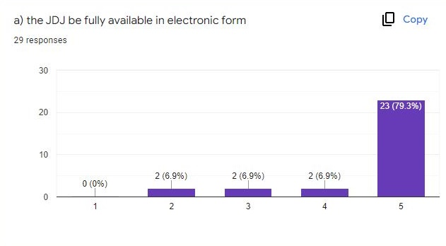
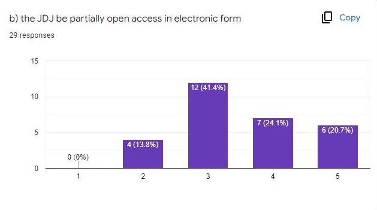
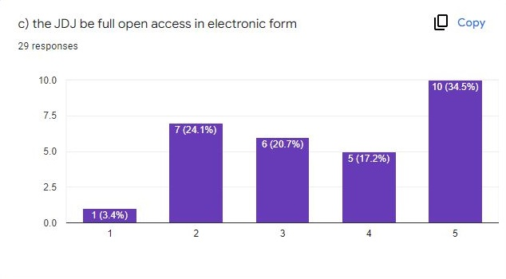
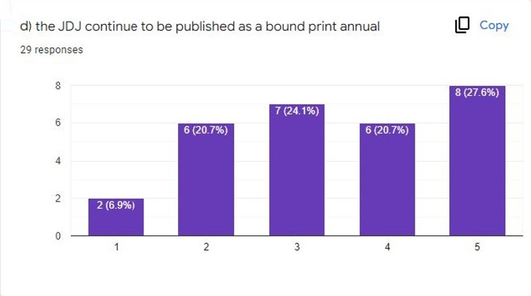

This paper presents a case study of the *John Donne Journal* (*JDJ*) as a means of examining the state of open access journal publication in the humanities (with a focus on Renaissance studies) and the current models available for moving a print journal not only into electronic access, but diamond (sometimes called "platinum") level open access. Of particular concern are the resourcing options for open access publishing in a sector where material and financial supports have long been in decline. In contemplating open access publication, we have four principal options:

-   *green open access*, where individual items (articles, in our case) are deposited in some sort of repository—commonly a mandated institutional repository—or in a more ad hoc way, as in a commons or commercial service (such as Google Scholar) where individual scholars might upload their work;

-   *gold open access*, in which content is freely available on the reader’s end, but authors are required to subsidize publication by paying an article processing charge, a model more commonly used in the sciences;

-   *diamond open access*, in which the content is (usually) born into open access, embargo- and barrier-free, typically because it is published in an open access (electronic) journal or other sort of publishing platform, and for which there are no author’s fees; or

-   *a hybrid model*, in which content is fully open access after an embargo period, during which time the most recent content (however that is defined temporally) remains behind a paywall, accessible only to subscribers.

In reality, the fourth model—the one most common in the humanities—is not always entirely open, because content might still be delivered through proprietary or commercial systems that are not accessible to everyone everywhere. Our findings indicate that journal publication in our field (broadly, Renaissance studies) has seen an almost total move to open access of some form—our journal being a rare and notable exception—but most of this move has been to a hybrid form, which has an embargo period that locks some content behind a paywall. The ultimate goal in this case study was to find a hybrid model of a different kind, such as one that enables continuation of a print artefact in its publishing plan and also offers all content in diamond open access.

## The Current Model of the *John Donne Journal*

*John Donne Journal: Studies in the Age of Donne* started publication in 1982, not long after the founding of the John Donne Society; although, in its early days, the journal itself was not an organ of the society.[^1] The *JDJ* was founded, edited, and housed in the Department of English at the State University of North Carolina (SUNC) with faculty members M. Thomas Hester and R. V. Young as its editors until volume 26 (2007) when Hester became sole editor. Through this time, the journal grew to become the primary venue for scholarship on John Donne, and the journal became ever more closely associated with the society, though it was essentially owned by the remaining editor. It was first published in paperback form with two issues per year, and then later as a cloth-bound annual since volume 14 (1995). Early on, the John Donne Society included an individual journal subscription in the cost of membership, but the primary source of funding was subscriptions sold to libraries. Around 2014, with the illness of Tom Hester, the journal was languishing and the John Donne Society began negotiations to assume ownership of the journal. This process was completed in 2016 when the journal was legally transferred to the society, and the executive board of the society named Sean McDowell, at Seattle University, its new editor. By that time, the journal was some three years behind in its publication schedule and some materials were lost in the transfer, including the backlog of submissions. Since then, McDowell has been trying to get the journal caught up in its publishing schedule. In November 2022, the journal published volume 36 dated 2017, and volume 37 (2018) is nearly ready for publication at the time of writing. A themed issue is in progress for volume 38 and submissions for volume 39 are accruing.

At present, the journal has about one hundred institutional subscribers at \$50 per year and around sixty individual subscriptions at \$30 per year, most of them related to society membership. At its peak, the journal had closer to three hundred institutional subscribers. WorldCat lists 274 libraries who have some holdings of the journal, and the now outdated entry for the journal in the MLA Directory of Periodicals states total circulation as five hundred. One notable trend, then, is the decline in our print subscription. This trend is probably reflective of changes in library acquisition of journals in recent years. A journal that is acquired through a single subscription is the exception: many libraries, especially larger ones, acquire most of their journal content through large-scale aggregators and providers like EBSCO, JSTOR, and Project MUSE (to speak only of the humanities, which is our context) or through book wholesalers. Another factor is the disrupted period before and during the transfer of the journal to the John Donne Society.

Subscriptions are the only source of income for the journal. This points to another significant development, and a larger trend in journal publication in the humanities and, more specifically, in literary studies: the diminishing of resources to support the management and production of journals. During *JDJ*’s time at SUNC, there was always one assistant editor in addition to the main editor(s), and most of the time there was also another editorial assistant or two.[^2] The editorships were supported with teaching release from the institution, typically three per term in the early history of the journal, and then two per term in the time leading up to the transfer of the journal. Editorial assistants and other costs were covered by subscriptions. There was also dedicated computer hardware and IT support in the early days as well as physical storage facilities for journal assets. In the words of the assistant editor through much of that period, Brian Blackley (also an instructor in the Department of English at SUNC), “NC State supported us well,” adding by way of general comment, “I suspect that print journal support has diminished lately” (pers. comm., 2022). This indeed seems to be the case. In its new home at Seattle University, there is no comparable support. The only tangible support comes from subscriptions, and this entire amount (approximately \$6,000 annually) is spent on printing and postage. Thus, tasks that would normally be handled by support and assisting staff are all handled by the journal editor.

## The Society’s Mandate for Electronic Representation

In February 2019, at the last meeting of the executive committee of the society before the pandemic, another society member, Jesse Sharpe, and I were tasked with developing a plan to create an electronic presence for the *John Donne Journal*. As a starting point, the committee wanted electronic access for society membership. The main impetus was that we did not have a “find it” button in the usual databases that would take users to an electronic surrogate of the print publication. Being a librarian by training (Sharpe) and a digital humanist (Nelson), our thoughts naturally went further: in 2019, and even more so in 2022, a move to electronic access also demanded serious consideration of open access. The one stipulation in our mandate, however, was that the print volume had to be preserved. This was the primary crux of our challenge in finding a model that would enable open access—either green open access or, ideally, diamond open access. A secondary but related consideration was sustainable resourcing.

*Why print?* Humanities scholars generally, and scholars of literature especially, are bookish folks. Notwithstanding scholarly demand for electronic access and a growing mandate for open access (discussed further below), scholars, who typically spend long days in front of screens, often want a print alternative. While journal articles tend to be one area of compromise in this preference (monographs less so, and, of course, articles can be readily printed on demand), the *JDJ* and its sponsoring society still value their print artefact. Since 1995, the *JDJ* has been published in a uniform, cloth cover in royal blue with a gold-embossed spine. These twenty-plus volumes look good on the shelf, are pleasant to hold, and are typically read from cover to cover by society members and other subscribers upon arrival. To be sure, there is both a practical and an affective attachment to this printed codex, but there really should be no need to defend or justify print publication. In any case, at this point in time, for the society, the print volume is non-negotiable.

As part of the planning process, we conducted a survey of society membership on matters related to use of digital resources generally. This was a follow-up to a 2009 survey that was intended to give us a cultural baseline for digital engagement in scholarship as we embarked on a project to build a digital archive of Donne’s prose to complement that of the Donne Variorum dedicated to Donne’s poetry.[^3] In addition to the set of questions related to use of digital tools in scholarly practice, we asked a series of questions to gauge enthusiasm for various modalities of publication for the *JDJ*. These are the results from a total of twenty-nine respondents, where 1 means “not at all important” and 5 means “very important.”

A. *Electronic form*: Not surprisingly, enthusiasm for access to the *JDJ* in electronic form is high, with nearly 80% percent of respondents indicating it is very important, but there were a few outliers for who the print journal is enough.

B. *Partial open access*: Less urgent is the need for some form of open access, but support here is still very strong among 20% of respondents. Notably, though, the largest body of respondents (41.4%) see open access as important (at 3 on the 5-point scale), but not a top priority.

C. *Full open access*: Here, we see some polarization: there is strong enthusiasm in one quarter (a combined over 50% indicating 4 or 5 on the 5-point scale) and on the opposite spectrum strong doubts about the urgency or necessity of full open access (27.5% indicating a ranking of 1 or 2). Those who highly value open access understand the value of full open access.

D.  Continuation of print publication: Here we see strong support for print publication, with enthusiasm levels similar to those for open access. Only 27.6% indicate that it is not at all or not very important that the journal continue to be published in print. It might be conceded, however, that those who respond to an electronic invitation to complete an electronic survey about electronic publication are probably inclined to reflect a shift in priority from print to electronic forms.

In sum, this informal survey seems to confirm that pursuit of a hybrid[^4] model that somehow enables full open access publication while preserving the print volume for those who choose to receive it is highly desirable to members of the society.

A secondary consideration for retaining our print volume while seeking a plan for open access is resourcing: the print volumes give us a concrete product that we can sell. Currently, our only revenue stream is sales of the print volume. The question, then, is whether we can somehow leverage the subscription model in our transition to some form of open access.

## The Cultural Imperative of Open Access

Regardless of the preferences and work styles of individual faculty members, open access publication is clearly becoming an expectation, both among scholars and within the larger structures in which we work.[^5] Increasingly, funding agencies are demanding that funded researchers make their work open. In the preamble to their “Open Access Policy on Publication (2015),” the Canadian federal government website of the Tri-Agencies (SSHRC, NSERC, CIHR) states,

As publicly funded organizations, the Agencies have a fundamental interest in promoting the availability of findings that result from the research they fund, including research publications and data, to the widest possible audience, and at the earliest possible opportunity. Societal advancement is made possible through widespread and barrier-free access to cutting-edge research and knowledge, enabling researchers, scholars, clinicians, policymakers, private sector and not-for-profit organizations and the public to use and build on this knowledge.

Further, these agencies ground their own policy in the larger global context:

Momentum for Open Access has been growing as numerous funding agencies and institutions worldwide implement Open Access policies. The Agencies strongly support Open Access to research results which promotes the principle of knowledge sharing and mobilization – an essential objective of academia (section 1. “Preamble”).

The result is a requirement that all the outcomes of any funded research must be freely accessible within twelve months of publication, essentially imposing a limit of one year on any publication embargo (section 1. “Preamble”). While this is not diamond open access—it preserves limited options for a hybrid model and for green open access—it is clearly moving in that direction. American policy makers seem to be following the same path rather more directly. On August 25, 2022, the American government’s Office of Science and Technology Policy issued a memo directing federally funded research agencies to adopt a policy of embargo-free open access publication for all funded research by December 31, 2025 (Nelson, 2022; International Science Council 2022). It remains to be seen how this directive will be implemented for scholarship in the humanities and in the context of the National Endowment for the Humanities, for example.

## The Practical Benefits of Open Access

As noted above, the primary impetus among society and *JDJ* leadership for seeking electronic publication is to serve the interest of those who already use the journal but also value the affordances of easy access, searching, quoting (some of the “scholarly primitives” usefully outlined by John Unsworth \[2000\]). A secondary interest is to expand the influence of the journal. Anecdotally, those associated with the journal have long suspected that its contents are underutilized and, crucially, under-cited. Faculty, as well as students, in a time-crunch are inclined to use easily accessed materials first, and it is tempting to bypass altogether a single article in a print journal that can only be accessed by interlibrary loan. Conversely, studies show that ease of access (particularly open access) increases use and citation (Draux, Lucraft, and Walker 2018). A scan of holding libraries seems to support this hunch. Further, geography seems to be a factor. Of the 274 libraries identified in WorldCat as holding the journal in some portion, only fourteen are in the United Kingdom. This is concerning because of the obvious cultural relevance of John Donne to the United Kingdom and the amount of scholarship produced there on Donne and his contemporaries. Also concerning is a lack of geographical reach and diversity, with only twelve holding libraries listed outside the United States (198), Canada (23), and the United Kingdom (14). So, a second interest in electronic access is diversity in expanding access to scholars who might not have had easy access to the physical copy. Electronic publication will also enhance the visibility and findability of the journal with a stronger web presence and, potentially, better representation in various databases that aggregate journal content. An electronic surrogate of our print-based articles, served through the MLA Bibliography in EBSCO, for example, as a single measure, would greatly increase access to journal content. More citations and greater usage in turn enhances the profile and elevates the status of the journal.

There is more to be gained beyond increased access and usability in making content available in a more open form of publication. Full open access gives the issuing body (in this case, our society) fuller control over their content and scholars fuller access and scope for using and even adapting the content. That access is without regard for geographical or demographic boundaries, the only limitation being one’s access to the internet. For the purposes of this group, an open form of publication presents diverse possibilities for linking and integrating journal content with other digital materials. In the case of scholars associated with the John Donne Society’s Prose Project and with the Prototyping the Digital Archive group in INKE, this means exploring possibilities for linking, or at least associating journal content with an annotated bibliography of Donne criticism and with transcriptions and images of documents containing Donne’s works.[^6] The form such an archive might take, and the place of journal content within it, is limited only by the imagination and the human and computational resources we are able and willing to apply to it (Nelson 2019).

## The Current State of Open Access Journal Publication in the Humanities With a Focus on the Renaissance

A survey of journals in Renaissance studies (referenced above) represented in the MLA Directory gives a snapshot of the state of open access journal publication in the humanities. While there might be journals in other fields that could provide better insight and ideas for our case, we chose to focus on Renaissance journals because we needed some criterion for selectivity so as not to be overwhelmed in cleaning and processing the information, and we thought a survey of journals in Renaissance studies might be of interest to peers working in our field. In a search of the MLA Directory with subject keyword “Renaissance” OR subject time period “1500-1599” OR “1600-1699” we received a result of 108 journals.[^7] Of these, ten are published or sponsored by a scholarly society. Out of these, seven are available in open access. Of these, four are published and distributed by the societies themselves and two are published by their respective societies but distributed by revues.org (now OpenEdition Journals), possibly because of France’s involvement with the Berlin Declaration for Open Access. The last journal, *Milton and Melville Review*, seems to have been discontinued in 2011. All of the surviving open access journals were either born digital or transitioned completely online. The three society journals that are not available in open access, notably, are distributed by aggregators like EBSCO, Project MUSE, ProQuest, and Gale, and this distribution model enables both print and electronic publication. Our main finding about the total set of 108 Renaissance journals is that the most common means for making some content open access is what is commonly known as the hybrid model, in which some portion of the content is freely open while other content is reserved for subscribers.

## Hybrid Model: Database Aggregators/Distributors

The primary facilitators of *this* hybrid model are the commercial aggregators. An obvious option for making print journals widely available in electronic form is a content provider/aggregator such as EBSCO, JSTOR, or Project MUSE. There are (or were) a few clear benefits to this option:

-   the ubiquity and high profile of these databases in major university library systems;

-   easy pathways into journal content, as many scholars search directly through these providers' search interfaces; and,

-   crucially for our purposes, revenue that comes back to the journal in the form of royalties.

In 2019–2020, I contacted each of these aggregators. I was able to connect with a live person at EBSCO (having made a first approach through their contact webform) and supplied my application information. After brief correspondence, the last message I received, on November 9, 2019, was an update stating that the acquisitions team was still considering our application. Correspondence with JSTOR finally resulted in a rejection in January 2021, a year after my first contact. In this message, I was told that JSTOR was reviewing its collection development plans and therefore was not expanding their collections with new journals at that time. I was assured that this news was not a reflection of the quality of the journal, but rather part of a planning process that would ensure the sustainability of JSTOR as an independent, not-for-profit service. After several helpful and informative exchanges with Project MUSE in February 2020, my contact indicated that the next round of review would be in spring 2021, and then, in answer to a follow-up in December 2021, I received a message that elaborated some of the circumstances and challenges posed by journal aggregators. Project MUSE froze their prices for both 2021 and 2022 because of the hit that libraries took to their budgets during the pandemic. As a result, they were only able to add journals when existing journals left the collection. They were unsure what the intake process would look like for 2023, but the timeline would probably be similar to what it had been previously: reviewing of submissions in the late spring with the hope of having collections in place by the end of the summer. I sent a follow-up message August 2022 and received no response. There has been a lot going on over this stretch of time, even beyond the pandemic.

I summarize these exchanges not as criticism (despite their limitations in openness, these services have done a lot to make scholarly content more widely and easily available), but rather because they suggest something about this service of distributing journal content and redistributing some of the proceeds back to the journals. Both JSTOR and Project MUSE are reviewing the publishing model they had been following through the first phase of their business. The response from Project MUSE indicates that revenues are stagnant and thus the time has passed for journals who did not get in before the pandemic. The pandemic is part of the context here, but the case of Netflix suggests something else as well: there are few prospects for new subscriptions and thus no new resources for taking on new content. Those libraries that were in a position to subscribe have already done so, and one wonders whether some have since lost their funding and have pulled away. This option of the commercial aggregator/distributor therefore seems largely unavailable to new entrants. Even so, while this hybrid model presented a funding solution for journals, it also limited the scope of open access.

## The Question of Resourcing and Sustainability

The problem of resourcing is common to all independent journals (those not tied, for example, to an academic press), and specifically for open access journals. The sustainability models and revenue sources offered by Public Knowledge Project present a representative sample of where open access journals look for resourcing (PKP n.d.). Some of the solutions offered make sense in a sciences context, but not in the humanities. One is to move to a volunteer editorial board (has any humanities journal ever paid its editorial board?). Another is to implement article processing charges, which has no place in the culture of humanities scholarship or in open access publishing generally. Another offered solution is financial support from an association or related institution, which applies to our case in some degree. Many journals have some support from their home institution, usually in-kind in the form of infrastructure. In recent years, libraries have been serving that role, in part because they are often the unit where the mandate for open access is championed and implemented, commonly in the form of institutional repositories. They also often provide and support open access software, such as OJS, thus providing hosting services for journals. Another recommendation is to seek community donations (add a donate button to the site). There are legitimate questions here about why journals should resort to charity when the work of the journal is part of the core mission of the university and the institutions that support it. That said, some element of community support is built into many independent journals, including that of our society, which has non-profit status and has received gifts and donations in the past. Moreover, there is a sort of crowdfunding element in some of the options I discuss below.

### Sources of Direct Funding

As financial support for universities generally is under pressure amid a widening trend of governments pulling back public funding, continuation of the sort of institutional support the *JDJ* once enjoyed, and perhaps a few smaller, independent journals still enjoy, seems unlikely. In the Canadian context, the Aid to Scholarly Journals grant program at SSHRC is in a similar situation to the aggregator databases in that it is a mature program with limited funds already accounted for with minimal opportunity for new entrants.[^8] In our case, the Canadian-affiliation rules pose a challenge for an international journal that is housed in the United States. Érudit (as part of Coalition Publica) would pose similar challenges.[^9]

A new trend is for a more independent model for funding scholarly journals. One such model is the Open Library of the Humanities (OLH), a non-profit, charity-based initiative at Birkbeck College, University of London (Open Library of the Humanities n.d.). OLH is a cooperative of scholars, librarians, and programmers that is funded through library partnerships and memberships, and these funds get redistributed to their hosted journals. A couple of Canadian journals are hosted there: *Digital Medievalist* and *Digital Studies / Le champ numérique*. On the surface, a journal like *JDJ* qualifies:

-   must be peer-reviewed,
-   has been established for at least five years,
-   currently funded through a subscription model,
-   based in a humanities discipline, and
-   has an international editorial board.

This, then, is an open access version of the distribution model exemplified by JSTOR or Project MUSE, which are also non-profits, though they follow a more commercial model in selling subscriptions. Significantly, both had their genesis in a library context.

In the same vein is LYRASIS Open Access Community Investment Program (OACIP) (LYRASIS n.d.). This program follows a crowdfunding model aimed at academic libraries. Again, the idea is to gather funding from partnering libraries and then distribute the collected resources to journals that are admitted to their program through an application process. This program is focused on smaller, independent journals and provides funding for terms of up to five years. Again, the *JDJ* would seem to fit this model.

A more progressive variant of the hybrid model identified in our survey of Renaissance journals is *XVII-XVIII: Revue de la Société d'etudes Anglo-Américaines des XVIIe et XVIIIe Siècles*, which is a rare instance of a journal that was not born open access but transitioned that way, now published through OpenEdition Journals (formerly revues.org).[^10] This journal is also a rare case of an open access journal that maintains a print version. It is also a society-published journal, belonging to the Société d'études anglo-américaines des XVIIe et XVIIIe siècles, and it is also published as a print annual.[^11] In this model, journal content is available for open access, but only in HTML full-text format. Downloadable formats (PDFs and ePub) are behind a paywall subject to a freemium subscription system on Revues/OpenEdition, which aims to “\[allow\] libraries to pursue an acquisitions policy that both encourages the development of open access and respects the needs of teaching, research and learning communities” (OpenEdition, n.d.-e). Subscribing gives “libraries and their users access to PDF and ePub formats” without download limits. They also say that 100% of revenue from this system goes back to open access development (OpenEdition, n.d.-d). In this case, all content is freely available, but a version of premium access requires subscription.

The most interesting model proposed by the OJS primer on sustainability models is something called Subscribe to Open (S2O), a somewhat vaguely conceived model that relies on traditional journal subscription payments from institutions, but results in publications being made open access to the public as long as subscription payments are sustained. The S2O model employs a sort of gaming/GoFundMe model as enticement:

> S2O allows publishers to convert journals from subscriptions to OA, one year at a time. Using S2O, a publisher offers a journal’s current subscribers continued access. If all current subscribers participate in the S2O offer (simply by not opting out) the publisher opens the content covered by that year’s subscription. If participation is not sufficient—for example, if some subscribers delay renewing in the expectation that they can gain access without participating—then that year’s content remains gated. The offer is repeated every year, with the opening of each year’s content contingent on sufficient participation. (S20)

This is perhaps an overly complicated and convoluted approach to enticing subscribers to convert to open access, but the core objective is worth consideration.

## A New Option: The ‘Hipster Model’

A variation of the S2O model is available to *JDJ* precisely because we still have a tangible product for which we currently sell institutional subscriptions. I call this (for now, with tongue in cheek) the *hipster model*. The premise here is our society’s valuing of legacy material and the pleasures they afford: the publishing equivalent of the vinyl record. Another ‘hipster’ element is the embrace of the niche. It would be inaccurate to say the *JDJ* is a niche journal, but it is certainly specialized, and its audience is relatively small. And it is most certainly independent of the commercial and institutional publishing complex: one might say it is *indie*, to evoke another, related cultural phenomenon. This proposal is an even more independent approach than that of the S2O model.[^12] And in this model, the physical artefact of the journal is an asset rather than a liability. The proposal is this:

-   We build an electronic platform for the journal in OJS (Open Journal Systems) to provide robust support for the workflows of OA publication in a ubiquitous platform, and we make all our content freely available in diamond open access: all its back-issues and all its future issues with no embargo. Here we publish the PDF files used in the print production.

-   The price of subscription includes the printed object as well as privileged access to the electronic version with provided metadata in the major common standards used by libraries. Our idea here is to reduce labour in the acquisitions and accession process as much as possible.

-   We raise the institutional subscription price from \$50 to \$100 and designate the added \$50 as an open access premium. Our appeal in the first instance is ethical. All academic libraries, or at least pockets within them, understand the value and growing imperative of open access publication, and this imperative may grow stronger with evolving government policy. Many universities have adopted open access as an institutional priority. With our subscription we offer a way for libraries to signal their commitment to this policy imperative and to report their contribution in support of an independent, diamond open access publication. Moreover, there is also a cultural appeal to librarians in presenting a scholar-driven alternative to the overwrought corporate model that dominates much of the commercial academic publishing complex. We believe the opportunity to support the indie alternative will generate good will and willing participants.

-   We give libraries the option of receiving the print journal or of dedicating the whole \$100 as institutional support for open access. For areas of the library less driven by policy or ethical imperative, where one might wonder what, concretely, is being paid for, the print journal can serve as that tangible commodity, a *good* in both primary senses as something ethically right and useful, and as an object acquired in commercial exchange.

-   We offer the option of a five-year subscription commitment to further facilitate the acquisitions workflow. An objective here, as stated above, is to make acquisition as practical and resource neutral as possible. A five-year subscription amounting to \$500 gives value to the transaction and justification for the labour involved in the process.

With respect to process, another means of appeal to institutional subscribers (i.e. libraries) is to consult with them about the plan as part of our approach, and in this way to invite them to consider themselves partners working together towards an open access solution that works for and makes sense to them. Our first step towards implementation, then, will be to return to lost subscribers (who might have discontinued, in fact, because they moved *holus bolus* to online content suppliers). This will be our first target group for consultations to gauge the appeal of this new model of subscription. At the same time, we target institutions that never did subscribe with the same offer. And finally, we approach current subscribers, hopefully with a strong base of new subscribers to the new model, expecting that some current subscribers to the print-object model might fall away knowing that a free version will be available.

In this moment of transition, the print object will remain for those who want it, for whom a concrete object might justify subscription. For others, the ethical appeal of open access will be embraced as a way forwards. We also provide, as a product, metadata in the form subscribers want it for easy ingestion into their library systems, giving libraries and their users easy and premium access to content. There will be a “find it” button added to the MLA bibliography (which is the outcome, I think, most of my colleagues in the John Donne Society immediately hoped for when we began this process of electrification), so there would be at least that amount of infrastructural support built into our independent model of publication, but metadata provided by the journal would enable ingestion into library systems that don’t (probably can’t afford to) subscribe to an EBSCO product. And of course, our content will be indexed and findable through internet search engines. By this model, we will in fact make a virtue of the fact that we are small independent player, an anti-Elsevier model and emblem of cultural resistance while, at the same time, a champion of the codex (at least for now).

## Conclusion

This paper's title alludes to a famous quotation from John Donne's *Devotions Upon Emergent Occasions* (1624), written during and after a serious illness in 1623 when he was Dean of St. Paul's Cathedral. This particular mediation (mediation 17) is on the occasion of a bell tolling outside his bed-chamber window, marking the death of a parishioner, leading to this reflection:

No Man is an *Iland*, intire of it selfe; every man is a peece of the *Continent*, a part of the *maine*; if a *Clod* bee washed away by the *Sea*, *Europe* is the lesse, as well as if a *Promontorie* were, as well as if a *Mannor* of thy *friends*, or of *thine owne* were; Any Mans *death* diminishes *me*, because I am involued in *Mankinde*; And therefore never send to know for whom the *bell* tolls; It tolls for *thee*. (Donne, 1987, 87)

Here and elsewhere in his writing, Donne asserts our interconnectedness as people living and working in community. No life is lived and no work achieved in complete independence. Similarly, journals, certainly the *JDJ*, have always been a collective venture, involving university support systems, editors, board members, peer reviewers, a supportive scholarly community, the libraries and institutions that house it, and finally, its readers. In the age of open access publication, we seek a new configuration of that collective in order to involve an even larger continent of readers. In the shifting economics of academic publication, the persistent and essential piece of infrastructure of humanities scholars remains the library, and any forward-looking publication plan needs to look to this sector not as a potential customer but as a partner.

## Acknowledgements:

The members of the Prototyping the Digital Archive team are Brent Nelson (University of Saskatchewan), Jesse Sharpe (Houghton University), Matt Sherman (Drexel University), Miguel Dela Pena (University of Saskatchewan), Constantine Kaoukakis (University of Saskatchewan), Joel Salt (University of Saskatchewan), and Kyle Dase (University of Victoria). Brent Nelson would like to thank the following from the libraries sector for their valuable consultations: Candice Dahl, Librarian at the University of Saskatchewan, for advice at the early stages of this project; DeDe Dawson, also a Librarian at the University of Saskatchewan, for consultations and for commenting on an earlier draft of this paper; and Emily Hopkins, Coordinator of the University of Saskatchewan institutional repository and OJS expert for getting us started on an open access implementation of the *JDJ*. We also acknowledge the support of the Social Sciences and Humanities Research Council of Canada.

## References:

Dela Pena, Miguel and the Prototyping the Digital Archive team of INKE. 2023. "Survey of Open Access Journal Publication in Renaissance Studies." John Donne Society Digital Prose Project (blog). 31 August. [https://donneprose.blogspot.com/2023/07/prototyping-social-literary-archive.html](https://donneprose.blogspot.com/2023/07/prototyping-social-literary-archive.html).

Donne, John. 1987. *Devotions Upon Emergent Occasions*. Edited by Anthony Raspa. Oxford: OUP.

Draux, Hélène, Mithu Lucraft, and John Walker. 2018 “Assessing the Open Access Effect for Hybrid Journals.” A white paper for Springer Nature, June. [https://doi.org/10.6084/m9.figshare.6396290](https://doi.org/10.6084/m9.figshare.6396290).

Érudit. n. d. "Services Guide for Journals (Coalition Publica)." [https://www.erudit.org/public/documents/coa_services_journals.pdf](https://www.erudit.org/public/documents/coa_services_journals.pdf).

Government of Canada. 2015. "Tri-Agency Open Access Policy on Publications (2015)." [https://science.gc.ca/site/science/en/interagency-research-funding/policies-and-guidelines/open-access/tri-agency-open-access-policy-publications](https://science.gc.ca/site/science/en/interagency-research-funding/policies-and-guidelines/open-access/tri-agency-open-access-policy-publications).

INKE. 2023. Open Access Policy Observatory. [https://inke.ca/open-scholarship-policy-observatory/](https://inke.ca/open-scholarship-policy-observatory/).

S2O. n. d. Subscribe to Open. [https://subscribetoopencommunity.org/](https://subscribetoopencommunity.org/).

International Science Council. 2022. "US Policy on Open Access to federally funded research hailed as game-changer for scientific publishing." [https://council.science/current/news/us-policy-open-access-to-federally-funded-research-game-changer-for-scientific-publishing/](https://council.science/current/news/us-policy-open-access-to-federally-funded-research-game-changer-for-scientific-publishing/).

Lyrasis. n.d. Open Access Community Investment Program (OACIP). [https://www.lyrasis.org/](https://www.lyrasis.org/content/Pages/oacip.aspx)

Nelson, Brent. 2019. “The Social Digital Archive.” *KULA: Knowledge Creation, Dissemination, and Preservation Studies* 3 (1). [http://doi.org/10.5334/kula.12](http://doi.org/10.5334/kula.12).

Nelson, Brent. 2023. "Prototyping the Literary Archive: The Case of the John Donne Society's Digital Prose Project." John Donne Society Digital Prose Project (blog). 22 July. [https://donneprose.blogspot.com/2023/07/prototyping-social-literary-archive.html](https://donneprose.blogspot.com/2023/07/prototyping-social-literary-archive.html).

Nelson, Alondra, Executive Office of the President. 2022. "Ensuring Free, Immediate, and Equitable Access to Federally Funded Research." Memorandum for the Heads of Executive Departments and Agencies. [https://www.whitehouse.gov/wp-content/uploads/2022/08/08-2022-OSTP-Public-Access-Memo.pdf](https://www.whitehouse.gov/wp-content/uploads/2022/08/08-2022-OSTP-Public-Access-Memo.pdf)

OpenEdition. n.d.-a. "About." [https://www.openedition.org/6438](https://www.openedition.org/6438).

———. n.d.-b. “About OpenEdition Journals.” [https://journals.openedition.org/6438](https://journals.openedition.org/6438).

———. n.d.-c. “Cartes et cartographies dans le monde anglophone aux XVIIe et XVIIIe siècles.” [https://journals.openedition.org/1718/6535](https://journals.openedition.org/1718/6535).

———. n.d.-d. "OpenEdition Freemium for Journals \| 2023 Price list.” [https://www.openedition.org/26730](https://www.openedition.org/26730?file=1).

———. n.d.-e. “Journal Subscription.” [https://www.openedition.org/13053?lang=en](https://www.openedition.org/13053?lang=en).

Open Library of the Humanities (OLH). n.d. "Journal Applications to Join OHL." [https://www.openlibhums.org/site/academics/journal-applications-to-join-the-olh/](https://www.openlibhums.org/site/academics/journal-applications-to-join-the-olh/).

PKP (Public Knowledge Project). n.d. “Sustainability Models and Revenue Sources.” [https://docs.pkp.sfu.ca/journal-policies-workflows/en/sustainability](https://docs.pkp.sfu.ca/journal-policies-workflows/en/sustainability).

Social Sciences and Humanities Research Council of Canada. n.d. "Aid to Scholarly Journals." [https://www.sshrc-crsh.gc.ca/funding-financement/programs-programmes/scholarly_journals-revues_savantes-eng.aspx](https://www.sshrc-crsh.gc.ca/funding-financement/programs-programmes/scholarly_journals-revues_savantes-eng.aspx).

Unsworth, John. 2000. “Scholarly Primitives: What Methods do Humanities Researchers Have in Common, and How Might our Tools Reflect This?” Symposium on "Humanities Computing: Formal Methods, Experimental Practice" sponsored by King's College, London, May 13, 2000. [https://people.brandeis.edu/~unsworth/Kings.5-00/primitives.html](https://people.brandeis.edu/~unsworth/Kings.5-00/primitives.html).

[^1]: Starting with issue 9.1 (1990) the masthead names the John Donne Society as a “sponsoring body.”

[^2]: The early issues had another faculty member, John N. Wall, as book review editor.

[^3]: A brief report on this survey will be forthcoming.

[^4]: This is our use of the term, to represent a print and electronic open access model: more commonly *hybrid* is used to represent something like green open access, where some content is fully open and other content is not.

[^5]: See the Open Access Policy Observatory on developments in open access: [https://inke.ca/open-scholarship-policy-observatory/](https://inke.ca/open-scholarship-policy-observatory/).

[^6]: For an introduction to the work of the Prototyping the Digital Archive group and the society's Digital Prose Project, see Nelson 2023.

[^7]: The research informing this paragraph was conducted by graduate student research assistant Miguel Dela Pena, a member of the Prototyping the Digital Archive group. For a full report on this survey, see Dela Pena 2023.

[^8]: To qualify, journals must meet at least one of the two following criteria: a minimum of one third of the core editorial board is affiliated with an eligible Canadian postsecondary institution and/or the journal title is owned by a Canadian not-for-profit organization (SSHRC n.d.).

[^9]: Érudit adopts the same qualifying criteria from SSHRC (Érudit n.d.)[https://www.erudit.org/public/documents/coa_services_journals.pdf](https://www.erudit.org/public/documents/coa_services_journals.pdf)

[^10]: Open Edition Journals is a “comprehensive digital publishing infrastructure” for humanities publication and is run by the Centre for Open Electronic Publishing (Cléo), a public and non-profit organization (OpenEdition, n.d.-a). It is “now home to 450 online publications” with over “150 000 articles, 95% are available in full-text access” (OpenEdition, n.d.-b)[https://www.openedition.org/6438](https://journals.openedition.org/6438).

[^11]: Interestingly, this journal seems to rely on volunteers to facilitate the editorial process, including proofreading. An editorial note on volume 78 (2021) thanks “les relecteurs des articles qui, malgré des délais parfois courts, ont contribué à la bonne marche du processus editorial” (OpenEdition, n.d.-c).

[^12]: Some of these ideas were augmented and refined in a very informative consultation with Sharla Lair, Senior Strategist, Open Access & Scholarly Communication Initiatives with Lyrasis.

