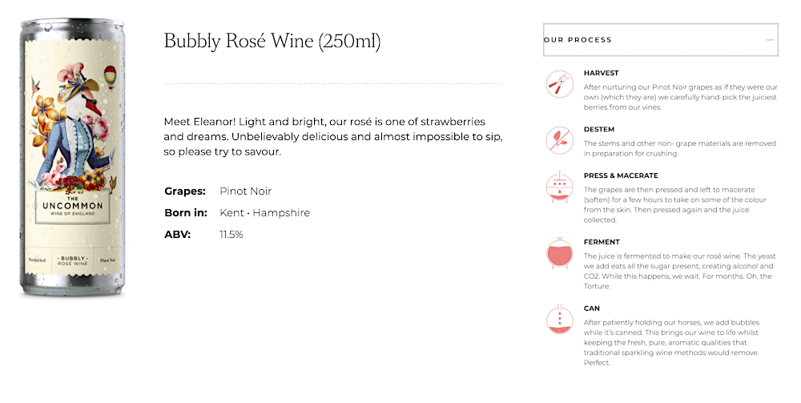

As an interdisciplinary researcher in the digital humanities, I have had the privilege of connecting with individuals across industries to discover how our fields intersect. My primary focus is always narratives: how they inform research, who they represent, and how we can learn from them. Recently, my dissertation research led me through an exploration of effective communication and rhetorical practices of sommeliers and wine professionals. Public engagement and collaboration continuously contribute to the progress of wine rhetoric because of the rhetorical situation’s centralization of narrative storytelling. “Stories,” says Master of Wine Susan R. Lin, “are central to humans establishing connections and emotional association, whether with other people or with objects or concepts” (2022). From my own experiences in the wine industry, narrative is what drives the community—from consumers to winemakers—towards stronger relationships with each other and with wine. When the general narrative of a culture’s lived experiences and rhetorical practices shifts this exponentially, a rhetorical analysis can offer a productive means for understanding communication changes and considering how certain practices carry over into other fields. In learning about new communication practices in wine, frameworks for teaching communication in the humanities have been re-envisioned in light of recent cultural revolutions.

## Cultural Rhetorics

At the beginning of 2020, a few months following my sommelier certification, I became active in Instagram’s wine community and launched a wine tasting Patreon subscription service. By 2022, I had been accepted into the Bâtonnage Forum mentorship program and was writing about wine and culture for *Paste* magazine. Through digital media, I was able to observe trends in wine communication and network with professionals all over the United States. Over the summer of 2022, I sought authentic conversations with thought leaders in wine through personal interviews and fused interview data with participatory observations to develop a comprehensive understanding of modern wine rhetorics. Due to recent cultural shifts in digital media and social interactions, many wine professionals have worked to interrogate outdated communication practices and reform wine education going forward. The evolving strategies of communication in the wine industry help inform humanities educators of how we too can reconstruct our practices to better serve modern scholars of rhetoric and composition.

Cultural rhetorics scholar and professor Dr. Jennifer Sano-Franchini supports the pursuit of interdisciplinary work in rhetoric and composition in her chapter for Ridolfo and Hart-Davidson’s *Rhetoric and the Digital Humanities*. Of cultural rhetorics specifically, Sano-Franchini argues:

> Cultural rhetorics theorizes how rhetoric and culture are interconnected through a focus on the processes by which language, texts, and other discursive practices like performance, embodiment, and materiality create meaning . . . Cultural rhetoricians draw from across disciplinary boundaries because diverse fields of study offer important insights about the relation between culture and knowledge. (2015, 52)

Here, Sano-Franchini indicates that rhetorically analyzing the communication practices of industry-specific discourse allows researchers to draw meanings from research that have the potential to positively impact the community. Situating rhetorical study within a specific, timely context helps researchers find the intersections between academic theory and rhetorical practice, thus helping guide us towards impactful community engagement. In this essay, I will discuss the rhetorics of modern wine communication through rhetorical analysis of industry discourse, concluding with broad suggestions for implementing similar strategies in humanities composition pedagogy.

## Reconstructing Rhetorical Frameworks

The current wine industry is undergoing widespread revolutionary change in communication practices and rhetorical strategy. In her article “Rethinking the Language of Wine,” journalist Tina Caputo embodies the collected voice of many industry professionals calling for a “more inclusive wine lexicon” that accurately reflects the diverse, multicultural, and underrepresented identities of people who engage with it (2023). This movement has gained increasing traction over the past few years, but the sentiment is far from new. In the 1980s, Dr. Ann C. Noble from University of California Davis developed the Wine Aroma Wheel (Figure 1) out of her passion for “how to best communicate with naïve wine consumers as well as facilitating clear communication between wine industry professionals” (n.d.). She noticed that many of the conventional wine descriptors like *round* and *elegant* did not make sense to new wine students, so she collected more approachable vocabulary and organized it in a visually stimulating way.

Since then, many wine organizations have adopted this structure and developed their own strategies for embracing novice and often younger audiences by understanding where people are in their wine journey instead of recycling the same stale rhetorical strategies.

## Pairing

One way wine professionals implement these strategies is by applying new rhetorical situations to foundational frameworks. In wine, a rudimentary concept of communication is pairing, or the art–science of creating new experiences through combining simple elements. At the core of this concept is the fundamental desire to generate new ideas by purposefully noting the connections between elements—even if these elements on their own might seem contradictory to one another. Pairing allows opportunities for new experiences and revived enthusiasm for known entities. Most importantly, pairing helps educators situate the role of conventional frameworks of thought by connecting traditional ideas with novel concepts.

The wine community is currently experiencing a period of revived interest in exploring unconventional pairings as a means of deconstructing and reconstructing frameworks for modern learners. In her *Forbes* article “Champagne and Music For Valentine’s Day,” Master of Wine Liz Thach discusses some of the ways wine professionals are applying pairing to more abstract situations. She highlights the work of Krug Champagne House Director Olivier Krug, who partnered with the Institut de Recherche et de Coordination Acoustique/Musique (IRCAM)—a French organization dedicated to scientifically studying music and sound—to create a special tasting room for tasting champagne and pairing it with different kinds of music. Unique pairings like this not only create new experiences for audiences, but they also greatly enhance the fun of professionals’ personal experiences working in wine. Furthermore, these experiences display the value of balancing tradition and innovation to develop new frameworks of thinking.

## Logos

In many ways, the wines themselves act as liquid archives for gathering data about terroir, winemaking, and cultural influences. When visiting Jose Maria de Fonseca winery in Setúbal, I was shown large barrels of fortified wine that are purposefully kept as they are for specific amounts of time so that, when eventually tasted, they impart the authentic characteristics of their vintage that help tell the wine’s story. This idea of wine collections as databases has been expanded over the past few decades as innovators in digital media and technology find new ways to catalogue wine information. This data, when interpreted by professional wine communicators, expose the logistics behind the wines that help inform audiences’ understanding of their narratives.

But the world of wine tech has had some major setbacks over the past few years. Wine writer Alder Yarrow argues that this is because the wine industry “lacks the imagination and inclination to participate in the kinds of digital transformations that most other industries have found essential over the past few decades” (2022). Regardless, the wine community seems to be aware of the exigency of effective digital rhetoric for the survival of the industry. Digital media and technology are essential for wine’s growth, but, as Yarrow blatantly puts it, “the question is whether they’ll get to it before they’ve lost the game, and all their digitally-native customers are entrenched customers of other types of beverage alcohol” (Yarrow 2022). Grappling with quickly evolving new technology is an issue across disciplines, and it can have large effects on cultural communication and rhetoric.

In the digital humanities, academic scholars explore ways that digital media and technology influence rhetorical practice, composition, archival research, and other important aspects of human-centered communication. Lai-Tze Fan, professor of technology and social change at the University of Waterloo, argues that our current explosion of digital innovations merits increased attention to these subjects. “As a field of scholarship,” says Fan, “the digital humanities are increasingly important to understand and develop, as they are uniquely attuned to the wide-ranging impact of digital media and culture” (2018). But, similar to wine tech, the humanities also struggle with our relationship with digital media and technology, as our teachings are under constant scrutiny for the practical purposes they serve.

Through analyzing the many human-based and digital tools available to enhance logical appeals in wine rhetoric, wine professionals apply the concept of pairing to efficiently juxtapose the affordances and limitations digital media and technology offers. The first step, Fan argues, is reflecting on the rhetorical purpose of the message:

> In using digital tools and methods to represent literature, then, digital humanists must ask whether the methodological prowess and scope of digital tools risk any loss of literary- and humanistic-based reflection and interpretation. (2018)

Using wine rhetoric as an example, we can practice our interrogation of these rhetorical purposes and the best tools available for effective persuasive communication by asking questions about the wine’s relationship with the audience. What is the difference between the learning opportunities available in Jose Maria de Fonseca’s collection of fortified wine versus a digital database of wine? While both venues offer the same result (enhanced understanding of wine), the learner’s journey towards this understanding happens in different ways. One method offers experience-based evidence at the expense of anecdotal anomalies, and the other method offers quickly-derived and peer-reviewed evidence without providing a personal, human-centered experience. These types of circumstances reflect similar learning opportunities in composition and rhetoric where humanities educators discern the value of different educational experiences.

## Pathos

These conflicts exemplify the ongoing challenge communicators endure where they must balance seemingly contrasting sentiments to develop new ideas and experiences. To do this, wine communicators focus on identifying with the narratives behind the wines and pairing elements together through metaphorical language. Metaphor has long been a fundamental element of wine communication, and current industry professionals are taking advantage of digital media to help wine metaphor strategies become more accessible to broader audiences. Fan points out that we tend to categorize humanistic, narrative processing as the opposite of digital, technological innovation:

> On the one hand, we live in an information age that privileges technological progress and that is tasked with the creation, storage, and management of large amounts of data. On the other, our (western) traditional methods of interpreting information are grounded in humanities philosophy—through theoretical, interpretive, and reflexive methods of understanding history, tradition, culture, and storytelling. (2018)

To face these conflicts, Fan challenges us to use the very technology that instigates our concerns to reveal gaps best addressed by more simplistic or traditional methods. Namely, to study the rhetorical influence of metaphor in industry-specific discourse, a researcher can analyze both a communicators’ strategies and a digital repertoire of metaphorical wine language, juxtaposing information from both spheres to draw timely conclusions.

Currently, many wine communicators are inadvertently applying these theories to research and analyze wine metaphors. Wine writer Miguel de Leon addresses this issue in his 2020 article “It’s Time to Decolonize Wine”:

> Traditional wine tasting grids and wheels are biased to Eurocentric flavors, and crucial wine vocabularies can center on foods completely foreign to my Very Asian Palate, like the description of body akin to the fat content of milk products or the essence of a flavor component wrapped up in a fruit I have never even heard of. (Seriously, what in the actual fuck is a gooseberry?)

This sentiment reveals the problematic outcomes of allowing rhetorical strategies to plateau. In rhetoric, metaphors are meant to display connections between two otherwise unrelated elements, and communicators who utilize metaphor do this to create personal connections for their audiences. But as de Leon’s narrative shows, certain metaphors have the opposite effect. Wine communicators cannot apply identification strategies with unrelatable metaphors, and access to entire digital databases of metaphors is not helpful if these databases are filled with the same Eurocentric examples. In these circumstances, reflection on the tools and technologies available is necessary for revising communication strategies for enhanced effectiveness. Our narratives present a purpose for rhetorical restructuring, allowing communicators to orient their strategies within the “present realities” of the current rhetorical situation (de Leon 2020).

## Knowledge Acquisition

However, widespread restructuring of educational frameworks calls for re-envisioning of how knowledge is collected, dispersed, and applied. In wine education, gatekeeping is still a problem for many communities. American wine culture often prioritizes strategy in small rhetorical situations of delivering a pungent message with a quick turnaround for success rather than a more overarching rhetorical situation of educating audiences towards genuine interest in the message for long-term engagement. In marketing, this can be shown by comparing and contrasting the multimodal rhetoric of the images below.

Figure 2 is the visual of an American canned rosé with its profile information. This text is focused on time and flexibility, offering the audience advice on when they could drink this wine (at any time, according to the heading) and how they could drink it (mixed with a range of drinks, including the audience’s unspecified “favorite liqueur”). The message behind this profile is rooted in a short-term rhetorical situation, essentially concocting a concentrated mix of rhetorical strategy aimed at the kairotic moment, which says *choose this wine now no matter where you are going next*.

Figure 3 details the profile of a European canned rosé—clearly offering more educational content for the audience. The rhetoric includes catchy gimmicks (humanizing the wine’s personality with an elegant, feminine name) and conversational banter (“While this happens we wait. For months. Oh the Torture.”) similar to the first profile. But this rhetoric offers a much larger amount of factual information behind the wine’s character, which not only shares a narrative but allows the audience enough insight to make an educated choice. The text’s simple breakdown of complex, industry-specific processes helps deliver the message: *know what methods generate good wine and see for yourself how we employ those methods*. This rhetorical strategy might result in delayed rhetorical success in the immediate kairotic situation, but it plays to the overarching and evolving rhetorical situation and manages a likely stronger, longer relationship with the audience by inviting them into the community via knowledge.

Through this lens, communicators can learn more sustainable methods of marketing wine to evolving audiences and establish wine as a human connector rather than an exclusive luxury. However, this still leaves the issue of non-white, non-Eurocentric representation in wine, a problem that many wine communicators believe can be addressed by researching more diverse rhetorical strategies. De Leon’s arguments do not stop at merely replacing old metaphors with new ones; his overarching argument demands universal restructuring of *how* we want to articulate wine information and *who* we want to give this knowledge to. This indicates a need for restructuring of persuasive communication towards community-building goals. These very ideas have recently ignited many conversations in the digital humanities surrounding the purpose of college composition, as many scholars agree that widespread reform is needed for this education to retain practicality in modern contexts.

## Ethos

Understanding what needs deconstructing and how to reconstruct practical frameworks of thought involves a process of open-minded experimentation. In her article “Dancing Over Dueling,” linguist Kate Dzubinski argues for reconsideration of rhetoric as a battleground. She points out examples of argument as war in English: “you can take a position, defend a position, your point can be attacked, you can have different strategies, and win or lose an argument” (2022). She then presents an alternative framework for teaching argument, citing George Lakoff and Mark Johnson’s sentiments in their 1980 publication *Metaphors We Live By*. In their vision, communicators and counterarguments are not viewed as opponents but rather dancers in a performance:

> Participants are seen as performers, and the goal is to perform in a balanced and aesthetically pleasing way. In such a culture, people would view arguments differently, experience them differently, carry them out differently, and talk about them differently. But we would probably not view them as arguing at all: they would simply be doing something different. It would seem strange even to call what they were doing “arguing.” (Quoted in Dzubinski 2022)

The theories expressed here display an intriguing alternative to how we discuss persuasive argumentation. In addition to our understanding of surface-level metaphors, Dzubinski argues that the general narrative of argument as war “highlights competition but hides the possibility of an argument where the goal of both participants is to come to an agreement” (2022).

Restructuring our metaphorical understanding of persuasive argumentation is an undertaking that starts with how we teach introductory students about rhetoric, similar to how “rethinking the language of wine,” as Caputo puts it, will likely call for larger restructuring of how wine communicators develop introductory experiences for novice explorers. In her conclusion, Dzubinski argues that war—“with its winner and loser, with the idea of wounds and casualties”—is a counterproductive means of teaching rhetorical persuasion because this framework does not promote “relational harmony” between communicators and audiences (2022). Inadvertently, she reiterates the idea of pairing in communication, calling instead for a rhetorical framework in which our goals are “closeness rather than domination” (Dzubinksi 2022).

Communicators’ audiences are interested in how they identify with a communicator’s rhetorical purpose and, therefore, how they reciprocally relate to each other. In wine communication, this has created a rhetorical situation in which ethos is co-generated based on the relationship between ourselves and our communities. These practices, according to wine writer Eric Asimov, help wine drinkers facilitate enhanced experiences for themselves, allowing us to “think of wine as an adventure” (Azimov 2022). Learning about the narratives behind the wines not only helps affirm buying choices but helps develop our knowledge of wine in general. Pursuing this learning is what Asimov and many other wine professionals believe to be the purpose of cultivating relationships around wine. In Asimov’s words:

> This is part of the joy of wine. Unexpected flavors and textures may lead you to new and different discoveries, expanding your realm of experience and adding to your understanding of what’s possible and what’s wonderful. (2022)

In regards to rhetorical ethos, Asimov’s argument indicates the need for wine professionals to act as credible and authentic storytellers for consumers. Rhetorical authority, therefore, is not proved through exclusionary education and certification but instead through one’s reputation as a human-centered educator with community-oriented goals.

In rhetoric and composition, community-engaged research helps mould our roles as rhetoricians. Dr. Maurice Charland, professor of Communication Studies at Concordia University, argues that “identity \[can be\] produced rhetorically through narrative” when rhetoricians employ Burkean principles of identification (2021, 27). Particularly, Charland notes the difference between this method of developing communicative authority as opposed to strictly Aristotelian methods of establishing ethos.

> Aristotle’s conception of ethos differs from that of identity because it is non-essential, but based in one’s performance . . . Each of these domains is constituted in practices directed toward the realization of internal goods, goods inherent to the practice rather than the product of the practice. (Charland 2021, 28)

Charland emphasizes the rhetorician’s relationship with their professional development, arguing that it is the process itself that creates rhetorical ethos. Moreover, the rhetorician’s reflection on and interpretation of their communication development helps constitute credibility.

Similar to this situation, the products of winemaking also reflect their process, as Asimov points out: “when \[a wine is\] altered in production, \[it\] no longer offers a faithful documentation. The result might be delicious, but it’s lost a dimension of its character” (2022). Truly high-quality wine “is a recording of a time and place as interpreted by the people who grew the grapes and made the wine” (Asimov 2022). From Asimov’s perspective, the process matters almost more than the product, as the process largely determines the intrinsic value of the wine. In the same way that Asimov calls wine drinkers to engage with and reflect on their wine drinking experiences to enhance their own learning, Charland argues that this kind of practice helps rhetoricians develop credibility within their community. Similar to how composition instructors teach writing as a process, we must also envision ethos as a process and embrace the learning that comes from experimenting under new frameworks of thinking.

## Community-Oriented Goals

The invaluable connection between the self and the community is embedded in humanities studies, as Devon Moriarty argues in her essay “Building a Better Barn: A Community-Oriented Approach to Rhetorical Scholarship.” Moriarty argues that comprehensive community-oriented rhetorical study must include consideration of its potential influence in the community itself.

> Although the notion of community has always operated within the peripheries of the rhetorical canon, I would argue that it deserves a central place in rhetorical studies, because how one identifies oneself and engages with others is always within the context of communities . . . Communities \[are\] liberating in their social power in that they foster belonging and security, and can, through the multiplicity of voices and coordinated action, enact change. (Moriarty 2021, 74)

Through this argument, Moriarty makes claims that echo the community-oriented goals of this research: to explore cultural rhetorics as a means of learning about how intersectional conversations can foster enjoyable, interdisciplinary relationships. Parallel to the idea of pairing, Moriarty demonstrates that her multidimensional identity characteristics are not in conflict with one another but rather consubstantial in her development as a rhetorician (2021).

The arguments discussed here reveal potential methods for recomposing teaching and learning structures to allow for more opportunities to reflect on the rhetorical situation and to thoroughly enjoy the process of developing ourselves as communicators. In the humanities, we can use the affordances of cross-disciplinary education to revitalize learning about traditional concepts by pairing unconventional and sometimes contrasting perspectives together to reveal new ways of thinking. Our continuous passion for new, engaging connections with other people and disciplines helps guide us towards methods of reproducing the most insightful experiences in evolving situations. With increased interest in experimental pedagogies and further efforts towards interdisciplinary relationships, our exploration of teaching communication, composition, and rhetoric becomes an enjoyable process of discovery prime for groundbreaking innovation in the humanities and beyond.

## Bibliography

Asimov, Eric. 2022. “Four Ways to Think About Wine.” *The New York Times*. [https://www.nytimes.com/2022/08/19/dining/drinks/how-to-think-about-wine.html](https://www.nytimes.com/2022/08/19/dining/drinks/how-to-think-about-wine.html).

“Bâtonnage Forum.” n.d. Bâtonnage Forum. Accessed April 20, 2023. [https://batonnageforum.com](https://batonnageforum.com).

Caputo, Tina. 2023. “Why Industry Professionals Are Rethinking the Language of Wine.” *SevenFifty Daily*. [https://daily.sevenfifty.com/why-industry-professionals-are-rethinking-the-language-of-wine/](https://daily.sevenfifty.com/why-industry-professionals-are-rethinking-the-language-of-wine/).

Charland, Maurice. 2021. “The Rhetorician’s Identity.” *Rhetor: Journal of the Canadian Society for the Study of Rhetoric* 8 (1): 26–32. [http://rhetcanada.org/rhetor-8-1/](http://rhetcanada.org/rhetor-8-1/).

de Leon, Miguel. 2020. “It’s Time to Decolonize Wine.” *PUNCH*. [https://punchdrink.com/articles/time-to-decolonize-wine-sommelier-racism-restaurants/](https://punchdrink.com/articles/time-to-decolonize-wine-sommelier-racism-restaurants/).

Dzubinski, Kate. n.d. “Dancing Over Dueling: How English Metaphors Make Arguments a Matter of War.” *ALTA Language Services*. Accessed January 28, 20223. [https://www.altalang.com/beyond-words/english-metaphors-arguments-war/](https://www.altalang.com/beyond-words/english-metaphors-arguments-war/).

Fan, Lai-Tze. 2018. “On the Value of Narratives in a Reflexive Digital Humanities.” *Digital Studies / Le Champ Numérique*. [https://www.digitalstudies.org/article/id/7322/](https://www.digitalstudies.org/article/id/7322/).

Lin, Susan. 2022. “The Power of the Story: Influences of Narrative in Shaping Wine Perception.” *GuildSomm*. [https://www.guildsomm.com/public_content/features/articles/b/susan-lin/posts/the-power-of-the-story](https://www.guildsomm.com/public_content/features/articles/b/susan-lin/posts/the-power-of-the-story).

Moriarty, Devon. 2021. “Building a Better Barn: A Community-Oriented Approach to Rhetorical Scholarship.” *Rhetor: Journal of the Canadian Society for the Study of Rhetoric* 8 (1): 70–79. [https://rhetcanada.org/rhetor-8-1](https://rhetcanada.org/rhetor-8-1).

Noble, A.C. n.d. “Ann Noble’s Aroma Wheel.” Wine Aroma Wheel. Accessed April 20, 2023. [https://www.winearomawheel.com/ann-noble-aroma-wheel.html](https://www.winearomawheel.com/ann-noble-aroma-wheel.html).

Sano-Franchini, Jennifer. 2015. “Cultural Rhetorics and the Digital Humanities: Toward Cultural Reflexivity in Digital Making.” In *Rhetoric and the Digital Humanities*, edited by Jim Ridolfo and William Hart-Davidson, 49–64. Chicago: University of Chicago Press.

VINNY Wines. n.d. “Meet Vinny.” *VINNY*. Accessed April 20, 2023. [https://www.vinnywines.com/about/](https://www.vinnywines.com/about/).

We are the Uncommon. n.d. “Bubbly Rosé Wine.” *The Uncommon*. Accessed April 20, 2023. [https://wearetheuncommon.co.uk/collections/home-page/products/bubbly-rose-wine](https://wearetheuncommon.co.uk/collections/home-page/products/bubbly-rose-wine).

Yarrow, Alder. 2022. “Pix Wasn’t the Only Wine Tech Failure I’ve Seen Up-Close.” *Vinography*. [https://www.vinography.com/2022/09/pix-wasnt-the-only-wine-tech-failure-ive-seen-up-close](https://www.vinography.com/2022/09/pix-wasnt-the-only-wine-tech-failure-ive-seen-up-close).

