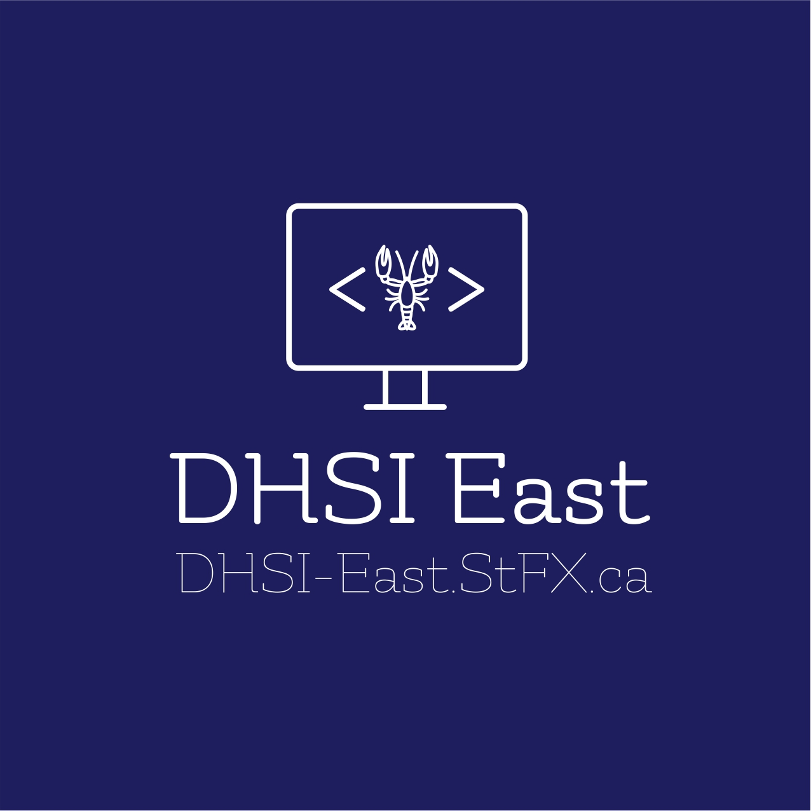

June 2021 marked the first year of DHSI-East,[^1] a new Atlantic Canadian training initiative designed to build on and expand the success of the Digital Humanities Summer Institute (DHSI), a major digital humanities training event held annually at the University of Victoria. This paper outlines the rationale for extra-curricular digital humanities workshops and reflects on the first years of DHSI-East.

Undertaking digital humanities (DH) research—that is, applying digital tools to humanities questions and thought[^2]—requires training. Today, it is possible to earn degrees in digital humanities in Canada (formerly *humanities computing*), though of course that was not always the case.[^3] As I wrote with Jennifer Guiliano (2023),

> despite the growing number of formal digital humanities degrees (Sula, Hackney, and Cunningham 2017; Walsh et al 2021), the vast majority of digital humanities training has long occurred outside traditional curricula as complementary initiatives. This is oftentimes a function of the variety of digital humanities training an individual might need and the relative paucity of local training opportunities due to limitations in faculty, staff, and institutional resources. But it is also a result of the interdisciplinary nature of the field where contributions to training might be made by technologists, librarians, cultural heritage professionals, and others beyond faculty or digital humanities staff. (1–2)

Johanna Drucker (Drucker and Berdan 2013) has suggested that DH is “a set of competencies and methods,” noting that “DH is always and add-on, extra.” Digital humanities encourages people to re-train and add skills during and after formal curricular training. Even those who complete degrees in digital humanities will not have mastered the full range of “competencies and methods” (to use Drucker’s formulation), and, indeed, methods and tools are always evolving. As Geoffrey Rockwell (2009) notes, often digital humanities training takes place when “a research project commits to a digital outcome and faculty without digital experience are supported and trained to deliver for an online outcome.” Workshops, then, fulfill an important role in digital humanities pedagogy. Digital humanities training “is not designed only for those people who consider themselves digital humanists: rather, it is often humanists who are interested in learning how they can apply digital tools to answer the questions raised by their humanities research” (Guiliano and Estill 2023, 2).

In Canada, the “most prestigious” (Rockwell 2009) and most-attended digital humanities training workshop is DHSI, which “was founded in 2000 on Vancouver Island, British Columbia, Canada” (Siemens, Arbuckle, El Khatib 2023). Ray Siemens, Alyssa Arbuckle, and Randa El Khatib (2023) offer this description of DHSI:

> Since its inception, DHSI has served as a community-based, annual training institute for the development and sharing of digital humanities skills, tools, and approaches. As the largest digital humanities curriculum in the world, DHSI mobilizes and leverages extant and ongoing activities across the arts and humanities and produces computationally-capable highly qualified personnel (HQP). The development of HQP carries forward benefits, research priorities, and knowledge output in the social sciences and humanities to key areas both within and beyond academia. The institute now draws hundreds of participants annually from academic, government, business, and cultural heritage sectors and DHSI continues to support this large and varied community of practice. (11)[^4]

Three DHSI participants, Voytek Bialkowski, Rebecca Niles, and Alan Galey, position DHSI as the “most successful response” to the pressing question “how do we learn what we need to know?” (2011, 20)—a question of particular importance for digital humanists.

DHSI attracts practitioners from around the globe. Yet not everyone can make it to Vancouver Island—and, more importantly, would the BiblioCafé or Moe’s (two on-campus coffee shops) be able to provide coffee for that number of people? It is important that digital humanities workshops be offered in different locations—even across Canada. To quote the Arrogant Worms’s unofficial anthem, “Canada is Really Big.” I currently live in Antigonish, Nova Scotia, on Canada’s Atlantic coast, which is almost 6,000km from Victoria, British Columbia, on Canada’s Pacific coast. Travel that distance is costly, bad for the environment, and time-consuming; it can exclude potential attendees who do not have institutional funding to attend or who are unable to travel long distances for health or personal reasons.

Online training is one way to increase accessibility. In 2020, 2021, and 2022, DHSI ran exclusively online with workshops offered in both synchronous and asynchronous formats[^5]; in 2023, DHSI offered both in-person and online courses, which can help reach a broader audience, but also requires (at least) twice the effort to coordinate and run. There is—and should be—no single solution to training people how to undertake humanities research in the digital world. Instead, we need multiple solutions: different events offered in different modalities, different places, different languages, different time zones, and on different topics. A decade ago, Chad Gaffield noted that “we don’t need a cookie-cutter solution” for digital humanities training; “it’s good we can offer a menu of possibilities” (qtd. in Bowness 2013). The menu for digital humanities training has changed and expanded over the years. DHSI is part of the DH Training Network[^6] and also the Canadian Certificate for Digital Humanities/Certificat candien en Humanités Numériques (cc:DH/HN)[^7]; there are many existing training opportunities where people can learn new digital skills. But before 2020, no DH training events were in-person, ongoing, and based in Atlantic Canada. And that is why we created DHSI-East: to be another option of DH training efforts in Canada and beyond.

Joining St. Francis Xavier University (StFX) in 2018, I proposed to start DHSI-East as part of my role as Tier 2 Canada Research Chair in Digital Humanities, with the encouragement of the DHSI organizers in Victoria. I have been involved in DHSI for a number of years, including as workshop instructor and participant, associate-director-at-large, and event coordinator for the aligned online conference, Open/Social/Digital Humanities Training, Pedagogy, and Mentorship.

Before we hosted the first DHSI-East, it was important to determine what the needs and wants of the regional community were with regards to digital humanities training. In 2019, we co-organized THATCampX (The Humanities and Technology Camp[^8]), which brought dozens of people to the StFX campus from across the region to discuss plans for digital humanities training in the Atlantic region (see the appendix for all event organizing credits). The discussion revealed that most people preferred in-person to virtual training (though, of course, this was from a group of in-person participants, which might not capture the voice of people who want virtual events). We brainstormed possible topics for workshops and decided on a multi-day in-depth workshop model. We hope, in future years, to run additional one-day THATCamp unconference events, perhaps aligned with the training workshops.

Based on discussions at THATCampX (2019), in 2021 we offered the inaugural year of DHSI-East. The workshop was on databases and was led by Harvey Quamen from the University of Alberta. We chose to offer databases training because we thought it would attract a wide range of participants; we chose an expert and well-respected DHSI instructor, Quamen. Richard Cunningham (Acadia University) secured funding from the Harrison McCain awards at Acadia University to bring in Quamen to teach DHSI-East and to collaborate on their shared research projects. As a seasoned DHSI instructor, Quamen was a great choice to attract participants and to bolster this new initiative. His workshop description included this gem: “By the end of this workshop you will be able to understand the following joke: ‘An SQL query walks into a bar and sees two tables. It saunters over to them and asks, “May I join you?”’[^9]

In 2021, the “Atlantic Bubble” was in place,[^10] which meant that Quamen had to fly to Nova Scotia and isolate for fourteen days before being allowed in public; all participants for the in-person event were from within the Atlantic Bubble, which, at the time, had virtually no COVID-19 infections. Quamen had just Finished his isolation and we were prepared to have the event as planned. Catering was booked, rooms and technology were ready—and then the Atlantic Bubble burst and COVID-19 overtook the region for the first time. Our keynote speaker, Chelsea Gardner (Acadia University) was already in her hotel in Antigonish when we made the heartbreaking decision to—to use the most hated words of the year—pivot online. Quamen and Gardner handled the situation with aplomb; with only a day to prepare an online version of his workshop, Quamen was ready. Lydia Vermeyden and Margaret Vail worked to support participants in an online classroom environment (BBCollaborate using StFX’s technology). Although some participants dropped out because of the move to online, most remained enrolled, and they spoke to the success of the workshop in their exit surveys.

Because of the chaos of the last minute pivot in 2021, we planned for the 2022 workshop to be entirely online, but we designed it to primarily serve the Atlantic Canadian community. We advertised the workshop widely to Atlantic Canadian audiences and capped the registration at 20 participants; in the end, most attendees were from Atlantic Canada with only a few from other places. We followed the model of the 2021 workshop: seasoned DHSI instructors working on an introductory topic that could appeal to audiences across humanities disciplines and with a keynote by an Atlantic Canadian researcher. For the 2022 workshop, Constance Crompton (University of Ottawa) and Emily Murphy (UBCO) offered “Introduction to Text Encoding.” Knowing that the workshop was going to be online from the outset let Crompton and Murphy take advantage of the medium to plan, for instance, an hour of morning drop-in where participants joined with particular questions about their encoding before starting the official instruction on that day’s topics. The co-instructor model proved just as valuable in the virtual instruction as it is in-person: at different times, an instructor (or event organizer, who sometimes acted as a teaching assistant) could pop into a breakout room to help with the inevitable troubleshooting that comes from digital humanities instruction.

Of course, we learned a number of lessons from hosting an online event (for more of these lessons learned from hosting virtual digital humanities workshops, see Watson and Simpkin 2023 and Croxton 2020, among others).[^11] It was also challenging to explain the expectations of a four-day online workshop to participants. It is hard to book time to attend a four-day in-person workshop, but to book time to attend a four-day virtual event can be almost impossible—it’s too easy to be dragged into a meeting or to run off to teach a class when you’re in a virtual event; whereas, if you’re at an in-person event, you no longer have the same obligations. In their exit surveys and follow-up communications, attendees said that they were impressed at how the vibrant chat built community and that they found the workshop informative and useful. Many respondents wanted to return to in-person; some, however, said that online worked well for them—which can often be the case for people with caregiving responsibilities, accessibility needs, or many other valid reasons that can make in-person events hard to attend.

April 2023 marked the first in-person DHSI-East workshop, “GIS for Humanists,” led by Jennifer Grek Martin and Jennifer Strang (both of Dalhousie University) with Matthew Schumacher (StFX), which took place on campus at StFX University in Antigonish. Grek Martin and Strang designed the workshop and led the instructional sessions; Grek Martin, Strang, and Schumacher circulated to answer questions. Grek Martin and Strang chose Lawrence Hill’s *The Book of Negroes* (2007) as our sample text, which allowed participants to explore and visualize data about Aminata’s travels, Canadian census data, and historically black communities in Nova Scotia.

As a single workshop (capped at 20 participants) over four days with a single keynote, the first in-person DHSI-East was a more subdued gathering and a smaller community than DHSI or other multiday workshops. (While there is a lot to be said for the busy, immersive, and social days in Victoria, at least in Antigonish you do not have to walk back up the hill from Smuggler’s Cove!) The participants were mainly from Atlantic Canada, with a few international attendees. Exit surveys described the event as “an exceptional learning experience” and “an engaging workshop.”

In both 2021 and 2022, DHSI-East had a single keynote speaker who presented online. Offering an online keynote attracted over a hundred attendees from around the world, many of whom would not have been able to attend in person in Antigonish. With permission of the speakers (Chelsea Gardner, 2021; Ken Penner, 2022), we recorded the talks and they are still available online (see Appendix A). For THATCampX 2019 and DHSI-East 2023 we recorded the in-person keynotes (Bonnie Stewart, 2019; Joshua MacFadyen, 2023) and made the recordings available on YouTube afterwards. Although a hybrid in-person event that is also synchronously streamed online might be ideal, it can be cost prohibitive and asks a lot of a speaker to manage.

The first three years of DHSI-East reminds us that there is more to workshops than a binary of in-person or virtual: both in-person and virtual can have different flavours depending on size and who attends. One is not inherently better than the other and different participants will have their own preferences, which emphasizes the value of offering multiple workshops.

As organizers, we are already looking to the years ahead. The feedback from our community, as registered in exit surveys, suggests interest in future workshops on topics such as artificial intelligence (AI), large language models (LLM) and natural language processing (NLP), Natural Language Toolkit (NLTK), network analysis, data in the humanities (creating, cleaning, using), Indigenous digital humanities, and project management. Many of these workshops already exist in the digital humanities training ecosystem in Canada, and we would be happy to offer them to the Atlantic Canadian participants. Where possible, we hope to invite Atlantic Canadian instructors and keynote speakers, while also collaborating with our national and international colleagues. DHSI-East is currently the only Atlantic Canadian group in the Digital Humanities Training Network and in the Canadian Certificate for Digital Humanities. In the future, we anticipate expanding our collaborations within Atlantic Canada and beyond. This could include bringing in organizers, instructors, keynote speakers, and participants from new institutions. Some future challenges could include securing funding to make participation not cost prohibitive, especially for students and under-waged attendees; facing the realities of pandemic burnout for participants, instructors, and organizers; and continuing a commitment to equitable and accessible instruction. As always, organizing this kind of event is not a one-off; it is an iterative process, which means continued labour, but also offers opportunities for bringing in new collaborators and rethinking ideas and implementation.

DHSI-East has always been designed to foster an Atlantic Canadian digital humanities community. This is particularly important because of the preponderance of smaller academic institutions (including, for instance, Mount Saint Vincent University, St. Francis Xavier University, and Acadia, to name only some in Nova Scotia). And yet, there is still much work to be done for DHSI-East. In its configuration right now, DHSI-East does not, for instance, serve all of Atlantic Canada as well as it could. Memorial University, one of the major universities in Atlantic Canada, is based in St John’s, Newfoundland. It takes a twenty-hour car drive (including ferry) from St John’s to reach Antigonish—or a flight to Halifax, which currently costs $550CAD return according to Google Flights. Yes, Canada is *really big*; Atlantic Canada itself is big, too. During ThatCampX (2019), we talked about possibly having DHSI-East be a touring event that visits different campuses at different times—and, indeed, this could be a potential future solution, especially if there is an appetite for local organizers based in different areas to join the team.

Building a community of practice (following Garcia, Bello, Dickerson, and Hogarth 2021) takes time. DHSI-East is one way we can help build the DH community in Atlantic Canada, by creating, to use Miriam Posner’s words, “a community of people who learn together” and “support each other” (2016). The digital humanities community relies heavily on workshops to fill gaps in our training; to be a digital humanist is to be constantly learning, training, and re-training. By adding to the constellation of digital humanities training opportunities in Canada, DHSI-East can help make training more accessible, help foster our community, and support our ongoing learning efforts.

## Appendix A

### DHSI-East Workshops and Keynotes to date

#### Workshops by year, with organizers listed alphabetically by surname

<table style="width:99%;">
<colgroup>
<col style="width: 11%">
<col style="width: 31%">
<col style="width: 35%">
<col style="width: 22%">
</colgroup>
<thead>
<tr class="head">
<th style="text-align: left;"><strong>Year</strong></th>
<th style="text-align: left;"><strong>Workshop</strong></th>
<th style="text-align: left;"><strong>Instructors</strong></th>
<th style="text-align: left;"><strong>Modality</strong></th>
</tr>
</thead>
<tbody>
<tr class="odd">
<td style="text-align: left;">2023</td>
<td style="text-align: left;">GIS for Humanists</td>
<td style="text-align: left;">Jennifer Grek Martin (Dalhousie
University) and Jennifer Strang (Dalhousie University), with Matthew
Schumacher (St.&nbsp;Francis Xavier University)</td>
<td style="text-align: left;">In-person</td>
</tr>
<tr class="even">
<td colspan="4" style="text-align: left;"><strong>2023 organizers:</strong> Richard Cunningham
(Acadia University), Laura Estill (St.&nbsp;Francis Xavier University),
Meghan Landry (ACENET), Margaret Vail (St.&nbsp;Francis Xavier
University)</td>
</tr>
<tr class="odd">
<td style="text-align: left;">2022</td>
<td style="text-align: left;">Introduction to Text Encoding</td>
<td style="text-align: left;">Constance Crompton (University of Ottawa)
and Emily Murphy (University of British Columbia-Okanagan)</td>
<td style="text-align: left;">Online</td>
</tr>
<tr class="even">
<td colspan="4" style="text-align: left;"><strong>2022 organizers:</strong> Richard Cunningham
(Acadia University), Laura Estill (St.&nbsp;Francis Xavier University),
Meghan Landry (ACENET), Margaret Vail (St.&nbsp;Francis Xavier
University)</td>
</tr>
<tr class="odd">
<td style="text-align: left;">2021</td>
<td style="text-align: left;">Databases</td>
<td style="text-align: left;">Harvey Quamen (University of Alberta)</td>
<td style="text-align: left;">Online (last-minute pivot)</td>
</tr>
<tr class="even">
<td colspan="4" style="text-align: left;"><strong>2021 organizers:</strong> Richard Cunningham
(Acadia University), Laura Estill (St.&nbsp;Francis Xavier University),
Meghan Landry (ACENET), Margaret Vail (St.&nbsp;Francis Xavier
University)</td>
</tr>
<tr class="odd">
<td style="text-align: left;">2019</td>
<td style="text-align: left;">ThatCampX (unconference)</td>
<td style="text-align: left;">-</td>
<td style="text-align: left;">In-person</td>
</tr>
<tr class="even">
<td colspan="4" style="text-align: left;"><strong>2019 ThatCampX organizers:</strong> Katie Aubrecht,
Matea Drljepan, Laura Estill, Wendy Kraglund-Gauthier, Meghan Landry,
and Margaret Vail (all of St.&nbsp;Francis Xavier University)</td>
</tr>
</tbody>
</table>

#### Keynotes

<table style="width:99%;">
<colgroup>
<col style="width: 9%">
<col style="width: 30%">
<col style="width: 30%">
<col style="width: 30%">
</colgroup>
<thead>
<tr class="head">
<th style="text-align: left;"><strong>Year</strong></th>
<th style="text-align: left;"><strong>Keynote</strong></th>
<th style="text-align: left;"><strong>Speaker</strong></th>
<th style="text-align: left;"><strong>Link</strong></th>
</tr>
</thead>
<tbody>
<tr class="odd">
<td style="text-align: left;">2023</td>
<td style="text-align: left;">“From Big Data to Dirt Research: Automated
and Participatory Maps of Atlantic Canada’s Rural Energy
Transitions”</td>
<td style="text-align: left;">Joshua MacFadyen (University of Prince
Edward Island)</td>
<td style="text-align: left;"><a href="https://www.youtube.com/watch?v=NidSHnD4Ees">https://www.youtube.com/watch?v=NidSHnD4Ees</a></td>
</tr>
<tr class="even">
<td style="text-align: left;">2022</td>
<td style="text-align: left;">“A Toolkit for Humanities Research and
Editing Ancient Documents”</td>
<td style="text-align: left;">Ken Penner (St.&nbsp;Francis Xavier
University)</td>
<td style="text-align: left;"><a href="https://www.youtube.com/watch?v=WYB1uOiT3J4">https://www.youtube.com/watch?v=WYB1uOiT3J4</a>
</td>
</tr>
<tr class="odd">
<td style="text-align: left;">2021</td>
<td style="text-align: left;">“Women, Websites, and Wikipedia:
Accessible Digital Pedagogy and the Undergraduate Classroom”</td>
<td style="text-align: left;">Chelsea Gardner (Acadia University)</td>
<td style="text-align: left;"><a href="https://www.youtube.com/
watch?v=B_xLrArwbek">https://www.youtube.com/
watch?v=B_xLrArwbek</a></td>
</tr>
<tr class="even">
<td style="text-align: left;">2019 (THATCampX)</td>
<td style="text-align: left;">“Digital Pedagogy in an Age of Algorithms:
What do we DO about Data?”</td>
<td style="text-align: left;">Bonnie Stewart (University of
Windsor)</td>
<td style="text-align: left;"><a href="https://www.youtube.com/
watch?v=tBJMRpxZZrw">https://www.youtube.com/
watch?v=tBJMRpxZZrw</a></td>
</tr>
</tbody>
</table>

## Works Cited

Bialkowski, Voytek, Rebecca Niles, and Alan Galey. 2011. “The Digital Humanities Summer Institute and Extra-institutional Modes of Engagement.” *Faculty of Information Quarterly* 3 (3): 19–29. [https://dspace.library.uvic.ca/bitstream/handle/1828/8220/Bialkowski_Voytek_FIQ_2011.pdf](https://dspace.library.uvic.ca/bitstream/handle/1828/8220/Bialkowski_Voytek_FIQ_2011.pdf).

Bowness, Suzanne. 2013. “Parsing the Humanities: Everything You Wanted to Know About Digtial Humanities.” *University Affairs*. [https://www.universityaffairs.ca/features/feature-article/parsing-the-digital-humanities/](https://www.universityaffairs.ca/features/feature-article/parsing-the-digital-humanities/).

Croxton, Rebecca A. 2020. “E-Learning in the Digital Humanities: Leveraging the Internet for Scholarship, Teaching and Learning.” In *The Routledge International Handbook of Research Methods in Digital Humanities*, edited by Kristen Schuster and Stuart Dunn, 384–98. Abingdon: Routledge.

Drucker, Johanna, and Jennifer Berdan. 2013. “The Emerging Field of Digital Humanities: An Interview with Johanna Drucker.” *InterActions: UCLA Journal of Education and Information Studies* 9 (2). [https://doi.org/10.5070/D492018433](https://doi.org/10.5070/D492018433).

French, Amanda, Boone Gorges, John Theibault, Lee Skallerup Bessette, Patrick Murray-John, Quinn Dombrowski, and Trevor Owens. 2020. *THATCamp Retrospective: Memories, Critiques, Epiphanies, Comments…* [http://retrospective.thatcamp.org/](http://retrospective.thatcamp.org/).

Garcia, Ashley Sanders, Lydia Bello, Madelynn Dickerson, and Margaret Hogarth. 2021. “Building a DIY Community of Practice.” In *People, Practice, Power: Digital Humanities Outside the Center*, edited by Anne B. McGrail, Angel David Nieves, and Siobhan Senier, 202–22. Minneapolis: University of Minnesota Press. [https://dhdebates.gc.cuny.edu/read/people-practice-power/section/66b55d5e-ada5-4c4f-bcae-e822c1cd2f9e](https://dhdebates.gc.cuny.edu/read/people-practice-power/section/66b55d5e-ada5-4c4f-bcae-e822c1cd2f9e).

Gouglas, Sean, Geoffrey Rockwell, Victoria Smith, Sophia Hoosein, and Harvey Quamen. 2012. “Before the Beginning: The Formation of Humanities Computing as a Discipline in Canada.” *Digital Studies/Champ Numérique* 3(1). [https://doi.org/10.16995/dscn.244](https://doi.org/10.16995/dscn.244).

Guiliano, Jennifer, and Laura Estill. 2023. “Introduction.” In *Digital Humanities Workshops*, edited by Laura Estill and Jennifer Guiliano, 1–7. Abingdon: Routledge. [https://www.taylorfrancis.com/chapters/oa-edit/10.4324/9781003301097-1/introduction-jennifer-guiliano-laura-estill](https://www.taylorfrancis.com/chapters/oa-edit/10.4324/9781003301097-1/introduction-jennifer-guiliano-laura-estill).

Hill, Lawrence. 2007. *The Book of Negroes*. Toronto: HarperCollins.

Hockey, Susan. 2004. “The History of Humanities Computing.” In *A Companion to Digital Humanities*, edited by Susan Schriebman, Ray Siemens, and John Unsworth. Oxford: Blackwell. [https://companions.digitalhumanities.org/DH/?chapter=content/9781405103213_chapter_1.html](https://companions.digitalhumanities.org/DH/?chapter=content/9781405103213_chapter_1.html).

O’Sullivan, James, Colleen Renihan, Andrew Prellwitz, Liam Murphy. 2016. “Telling Stories at DHSI: Interviews with Ray Siemens, Diane Jakacki, and Alyssa Arbuckle.” *Cultural Mechanics: A Podcast on Digital Culture, the Arts, Humanities, and Other Such Things.* [http://hdl.handle.net/10468/4517](http://hdl.handle.net/10468/4517).

Posner, Miriam. 2016. “Here and There: Creating DH Community.” In *Debates in the Digital Humanities 2016*, edited by Matthew K. Gold and Lauren F. Klein, 265–73. Minneapolis: University of Minnesota Press. [https://doi.org/10.5749/j.ctt1cn6thb.25](https://doi.org/10.5749/j.ctt1cn6thb.25).

Rockwell, Geoffrey. 2009. “The Academic Capacity of the Digital Humanities in Canada.” Philosophi.ca. Last modified October 23, 2009. [https://philosophi.ca/pmwiki.php/Main/TheAcademicCapacityOfTheDigitalHumanitiesInCanada](https://philosophi.ca/pmwiki.php/Main/TheAcademicCapacityOfTheDigitalHumanitiesInCanada).

Siemens, Ray, Alyssa Arbuckle, and Randa El Khatib. 2023. “The Digital Humanities Summer Institute (DHSI): Community Training Toward Open Social Scholarship.” In *Digital Humanities Workshops: Lessons Learned*, edited by Laura Estill and Jennifer Guiliano, 11–23. Abingdon: Routledge. [https://www.taylorfrancis.com/chapters/oa-edit/10.4324/9781003301097-3/digital-humanities-summer-institute-dhsi-ray-siemens-alyssa-arbuckle-randa-el-khatib](https://www.taylorfrancis.com/chapters/oa-edit/10.4324/9781003301097-3/digital-humanities-summer-institute-dhsi-ray-siemens-alyssa-arbuckle-randa-el-khatib).

Sula, Chris Alen, S. E. Hackney, and Phillip Cunningham. 2017. “A Survey of Digital Humanities Programs.” *Journal of Interactive Technology & Pedagogy* 11. [https://jitp.commons.gc.cuny.edu/a-survey-of-digital-humanities-programs/](https://jitp.commons.gc.cuny.edu/a-survey-of-digital-humanities-programs/).

Terras, Melissa, Julianne Nyhan, and Edward Vanhoutte, eds. 2013. *Defining Digital Humanities: A Reader.* Farnham, Surrey: Ashgate. 

Walsh, John A., Peter J. Cobb, Wayne de Fremery, Korajilka Golub, Humphrey Keah, Jeonghyun Kim, Joseph Kiplang’at, Ying-Hsang Liu, Simon Mahony, Sam G. Oh, Chris Alen Sula, Ted Underwood, Xiaoguang Wang. 2022. “Digital Humanities in the iSchool.” *JASIT: Journal of the Association for Information Science and Technology*. 73 (2): 188–203. [https://doi.org/10.1002/asi.24535](https://doi.org/10.1002/asi.24535).

Watson, Jada, and Sarah Simpkin. 2023. “Building Community and Collaboration through the Digital Humanities Toolbox Series.” In *Digital Humanities Workshops: Lessons Learned*, edited by Laura Estill and Jennifer Guiliano, 98–105. Abingdon: Routledge. [https://www.taylorfrancis.com/chapters/oa-edit/10.4324/9781003301097-12/building-community-collaboration-digital-humanities-toolbox-series-sarah-simpkin-jada-watson](https://www.taylorfrancis.com/chapters/oa-edit/10.4324/9781003301097-12/building-community-collaboration-digital-humanities-toolbox-series-sarah-simpkin-jada-watson).

[^1]: See [https://dhsi-east.stfx.ca](https://dhsi-east.stfx.ca).

[^2]: A fulsome definition of digital humanities is beyond this paper. For a starting point, see *Defining Digital Humanities: A Reader* (Terras, Nyhan, Vanhoutte 2013) and to Jason Heppler’s “What is Digital Humanities?” ([https://whatisdigitalhumanities.com/](https://whatisdigitalhumanities.com/)), a webpage that offers a different definition every time it is refreshed.

[^3]: Susan Hockey (2004) suggests that the University of Alberta was the first in Canada to offer a degree in Humanities Computing. For more on the history of DH with a focus on Canada specifically, see Gouglas et al 2012.

[^4]: For more history of DHSI, see the *Cultural Mechanics* podcast episode (O’Sullivan et al 2016).

[^5]: See [https://dhsi.org/course-archive/](https://dhsi.org/course-archive/).

[^6]: See [https://dhsi.org/dh-training-network/](https://dhsi.org/dh-training-network/); for more on global DH training, see Europe-based Digital Humanities Course Registry, [https://dhcr.clarin-dariah.eu](https://dhcr.clarin-dariah.eu), and Digital Research Skills Australasia, [https://dresa.org.au](https://dresa.org.au). These registries “only capture a fraction of existing workshops” (Guiliano and Estill 2023, 2).

[^7]: [https://ccdhhn.ca/](https://ccdhhn.ca/)

[^8]: [https://thatcamp.org/](https://thatcamp.org/). THATCamp has now been sunsetted; see French et al 2020.

[^9]: [https://www.mystfx.ca/digital-humanities/dhsi-east-2021](https://www.mystfx.ca/digital-humanities/dhsi-east-2021)

[^10]: Wikipedia offers a history of the Atlantic Bubble: [https://en.wikipedia.org/wiki/Atlantic_Bubble](https://en.wikipedia.org/wiki/Atlantic_Bubble).

[^11]: One practical takeaway I have is to record sessions in small chunks aligned with a workshop schedule.

