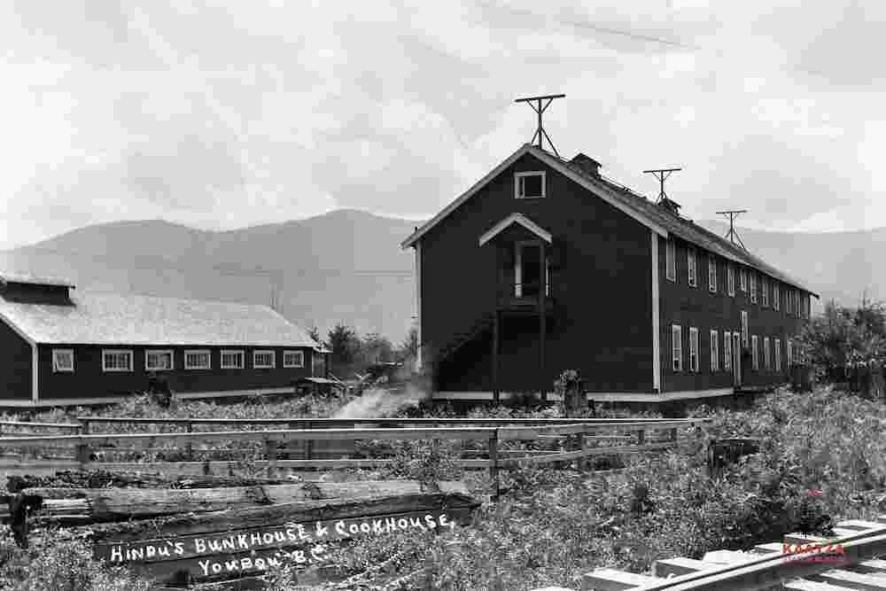

## Knowledge Production and Dissemination 

Systems of knowledge and the mediums of knowledge production have been and continue to be informed and imposed by western modes of thinking and learning. Decolonial scholarship refers to this intrinsic structure as “coloniality of knowledge” (Tlostanova and Mignolo 2020). Walter D. Mignolo argues that “it is the coloniality, not just colonization, that has a long history and made colonization possible. It was the control of knowledge that justified the demonization and dehumanization of people, civilizations, cultures and territories’’ (2015: xxvi). This logic remains deeply rooted, although the dynamics have changed on the surface. In the groundbreaking work on the politics of epistemic and ontological dimensions, drawing upon Frantz Fanon’s thoughts, Mignolo states that “racism was not only a question of the colour of one's skin but of language, and therefore of categories of thought” (2015: xvii). Kishore Mahbubani’s (1998) early work, *Can Asians think*? and Hamid Dabashi’s (2015) *Can Non-Europeans Think*? further questioned and unveiled epistemic racism hidden beneath the universalization of western imperialist ways of thought and knowledge production.

Archives, as key forms of knowledge creation, are also subject and object of the same sphere of influences. Archiving is a form of knowledge creation as it enables the creation of knowledge infrastructures—though as it builds that infrastructure from the inside out, it is also built and informed by knowledge infrastructures that already exist. A close study and analysis of this creation process reveals that, historically and at present, the power that is ingrained in the process matters: who archives and for whom and how; what is being archived, or, in other words, what is missing; who is missing in the archives and histories; what has been silenced; what has been erased in the process; and who are the gatekeepers of knowledge systems. As Natalie Harkin poetically describes, “those who accord themselves the right and power to gather/unify/identify/classify, who legitimise knowledge through hierarchy and order, who determine what is in/out/accessed/vetoed to future memory” (2020: 11). Archiving is a process in which knowledge is created, organized, and classified. It is also a process in which the ontologies and taxonomies are being made. Epistemic coloniality begins with that process, beginning with who is part of the process to those who dominate it. Archival standards, norms, and processes, including the knowledge frameworks that are currently in practice, were created primarily by western imperialist epistemologies—and they can reproduce and reinforce those ways of thinking and knowing. Mignolo argues that epistemic racism is “built on classifications and hierarchies carried out by actors installed in institutions they themselves created or inherited the right to classify and rank” (2015: xv). Using the South Asian Canadian Digital Archive (SACDA) as the case study, the paper looks at how to reimagine a knowledge system and praxis with the production of multiple epistemologies, languages, and vocabularies that are co-created as a community-driven project that informs, and is informed by, collective histories.

## South Asian Canadian Digital Archive

SACDA, an initiative of the South Asian Studies Institute at the University of the Fraser Valley, is a pan-Canadian digital archive that documents the history and heritage of the South Asian diaspora[^2] in Canada. SACDA partners with memory institutions, community organizations, individuals, and families to digitize, describe, and provide online public access to heritage materials created by, or relevant to, the South Asian Canadian diaspora. SACDA seeks to fill a critically important archival and historical gap in Canadian history that continues unabated. In the context of South Asian Canadian archival materials being rarely available, erased, omitted, or neglected, documenting the lived experiences and the cultural heritage of South Asian communities is an urgent preservation priority. SACDA thus facilitates access to inclusive Canadian heritage by collecting, preserving, and presenting primary source materials of the South Asian Canadian diaspora’s over 120 years of history.

With extensive community engagement, a focus on social histories, and using collaborative tools as praxis, SACDA seeks not only to fill historical gaps but also to transform existing colonial knowledge infrastructures and to foster knowledge diversity and equity. SACDA emphasizes the cultures of orality, tacit knowledge, and visual histories and has created a thesaurus to rupture conventional controlled vocabularies. At the core of its praxis, SACDA seeks to actively involve the community in archival processing and holds community sessions to collect metadata in South Asian languages and vernaculars. SACDA uses an open access collection management system, Collective Access, to build a repository of multilingual collections and manage digitized materials. All of the materials digitized as part of the archive are freely available on SACDA.

## Building Multilingual Knowledge Infrastructures and SACDA Thesaurus 

<!-- ![Three single-page pamphlet publications. The first has a White Canada Crusade logo at the top and then text that reads: “aims and objects of the White Canada Crusade” with attribution to W. R. Page-Wilson and Associates and a mailing address: Post Office Box 370 Vancouver, BC. The second reads: “no room for the Hindu in our factory. We don’t employ Asiatics! Boys: When you want any paint, stains, enamel, varnish, wall finish, white lead or anything else in the pain line, demand goods made by us. We guarantee them. British America Paint Company, Limited. Victoria, Vancouver, Calgary, Edmonton.” The third reads: “Asiatic Exclusion League. A public meeting will be held in the Auditorium of Labor Hall Monday, August 12 at 8pm for the formation of the Asiatic Exclusion League in this city. All the local members of the Legislature and the Dominion member for this city have been invited to attend and address the meeting.”](image2.png "Figure 1: Racist publications included in Labour History exhibit. <i>Source:</i> Racist publications, 19-, textual records, File 2021_08_01_005-007, Labour History Exhibit collection, South Asian Canadian Digital Archive, University of the Fraser Valley, Abbotsford, Canada.") -->

The epistemic ecologies in which South Asian Canadian communities have been clustered and the structural oppressions imposed on them continue despite the different geographies. As many historians note, early immigrants from the region were classified and labelled as “East Indians” or “Asiatics” or “Hindu,”[^4] an overt example of western imperialistic conceptualizations of India or the East and how European dominance was embodied in the definitions and descriptions of this region.

Paromita Biswas’s (2018) compelling paper on this topic argues that the use of the Library of Congress subject heading “East Indians” in reference to individuals from India represents not only a problematic vestige of colonialism but also a failure of the principle of literary warrant. Her in-depth analysis of the term’s historical roots examines how naming practices such as controlled vocabulary systems reflect the power dynamics of colonialism and lead to the marginalization of peoples originating from areas under colonial sway.

The metadata creation process is key to building multilingual knowledge infrastructures. In many cases, appropriate terms to describe the content of South Asian Canadian materials are absent in conventional controlled vocabularies. For archival descriptions, SACDA follows the Rules of Archival Description (RAD), the Canadian archival descriptive standard, the Library of Congress Subject Headings (LCSH), and the Thesaurus for Graphic Materials (TGM). The LCSH subject headings have been a topic of criticism in recent years and the absence of epistemic diversity is pronounced. To address these gaps, as part of the knowledge infrastructure re-creation process, SACDA is developing a local thesaurus and authority list to describe the complexities of South Asian Canadian histories and heritage.

Below is an example from the Paldi collections on SACDA, in which the content of the archive would be lost, rendered invisible by the lack of discoverability, if only conventional archival standards and controlled vocabularies were used in creating the metadata.

### Example 1: Creating the Words

Paldi is a small lumber mill town on Vancouver Island. It was formed by Mayo Singh, an immigrant from Punjab, India, along with 34 shareholders. It started with the establishment of the Mayo Lumber Company and a mill in 1918, and a multicultural community grew up around the mill site. A thriving community of over 1,500 residents at its peak, it was home to people from India, primarily from Punjab, and a significant number of European, Japanese, and Chinese workers and families.

There was a gurdwara (Sikh temple), a Japanese temple, a school, cookhouses, and bunkhouses for the workers. The Paldi collection on SACDA is a microcosm of the histories of transnational migration and connections, labour, economies, markets, and a strong sense of communal living practices. For example, the Paldi community celebrated Jor Malla, a community festival every year on July 1, and families go back to celebrate as they continue to do so today.

The festival commemorated the building of the first gurdwara in Paldi and was held every year for over six decades. It combined religious elements with sports and games (including volleyball, soccer, weightlifting, and more) and food. People attended the festival not only from Vancouver Island but also from the Lower Mainland of British Columbia and other parts of Canada. Organized by the sawmill workers and families of Paldi, the festival is the story of workers and labour history. Many workers in Paldi were those who could not find employment elsewhere due to the racial discrimination of many workplaces that did not allow people from South Asia or Asia.[^5] The history of Paldi is the history of oppressed and discriminated communities coming together, sharing a space, a town together, and living through life’s challenges and celebrating together.

The documentation of this rich, multicultural society, and its cultural and social life, including its festivals, is important. Yet, there are no universally accepted subject topics in conventional controlled vocabularies that would enable this festival and this town to be made visible—in history and in search queries entered into a database. In this context, when there are no alternatives to describe this unique Jor Malla festival organized by the sawmill workers, SACDA creates new terms and descriptions to be mapped onto the collection management system. The SACDA thesaurus, therefore, is an alternative tool and space to document, reflect, and amplify these cultural and multicultural elements that are unique to South Asian Canadian diaspora communities. In addition, in the absence of authority records in the conventional institutional databases, SACDA documents all the entities—names, organizations, and the many ways in which people come together.

### Example 2: Making Connections 

The SACDA team has also had to address scenarios in which the global, transnational presence and connections of immigrants continues after people migrate, and how best to capture the nature of that transnationality. For example, there is a file in the Paldi collection that contains Mayo Singh’s diaries and day planners. Mayo Singh, being a businessman, was meticulous in documenting minute transactions and details in his diaries.

<!--  -->

There is a diary entry in which he documents sending an individual named Tara Singh to Ardaspur in Punjab, India, to buy one hundred *angithis*, traditional clay stoves, for $300. This purchase would have likely been for the sawmill workers’ cookhouse in Paldi in Canada. Cookhouses and bunkhouses played a crucial role in the lumber industry histories, as the existence of what would seem to be an architectural feature points to the broader story of single men who immigrated and shared these spaces built close to the mills. Canada’s exclusionary immigration policies prohibited these early immigrants from bringing their families to Canada. Mayo Singh was responsible for the cookhouse in Paldi when it was formed. In SACDA, the subject headings and descriptions for these items were created through extensive research and great care involving experts in the field.[^6]

  

### Example 3: Community Collaboration

Key to the SACDA praxis is collaboration with individuals, families, and community organizations in the knowledge creation process. The team asks and enables space for individuals and families to actively contribute to the archiving process, the classification, and descriptions. Once completed, the descriptions are sent to the individuals and families for review, and the SACDA team incorporates any additional information, names, context, and suggestions received into the metadata template. This process and level of engagement assist the SACDA team in creating robust metadata of the archival materials.

When the team is unable to locate adequate data or obtain direct access to the histories of the materials, the team reaches out to the source communities. SACDA holds community metadata creation sessions and workshops with community members, including elders, to involve them as part of the knowledge creation process. This process involves sharing the materials with the community members and gathering further metadata in their languages, in their vernacular, in their vocabularies to create and develop descriptions from the ground up.

One of the largest collections on SACDA, the Del Monte Studio collection, consists of roughly eight thousand photographs. The Del Monte Studio is a photography studio that operated for almost half a century in the Fraser Valley, British Columbia. The collection depicts marriage ceremonies, family photographs, and single photos people took to send home for marriage matchmaking, among others. The entire journey of people’s lives comes forth in this collection, starting as a child in a group family photo who is later depicted getting married, having children, and then posing with their grandchildren. However, in terms of data, the studio only documented the names of the people who booked the photoshoots, which, in the South Asian context during that period, was primarily men. There is an absence of women—their names, stories, and immigration histories—that it is now difficult to bridge.

During a community metadata session, the SACDA team met with a family who had their wedding photos taken by the Del Monte photo studio in 1973. Through this meeting, the team was able to learn more details about the events of the wedding as well as the extended family stories. There was one photograph in particular that the family asked to look at for a moment longer. The photograph centered on four young flower girls, with the bride seen in the background. But it was not the central subjects on which the family focused—it was an older woman seen in the corner of the photo. They noted that the older woman was in fact an elder in the community and had been in Canada since 1925. The family provided crucial migration and settlement histories of that elder and her family. It is small but important interactions like these and the community’s input that helps SACDA build more ground-level robust metadata describing these archival materials and their context.

## Conclusion

The power of coloniality that has dominated the production of knowledge and knowledge infrastructures has long benefitted from the privilege of invisibility. Rather than contextualized and composed of named ingredients, it has been, simply, *what is*. In being *what is*, its invisible power has rendered others silent, unseen, and absent. While archiving is a process of preservation, it is also a dangerous act, if it occurs without question or without expansion. As we peel back the layers of history and begin to surface the rich, multiple histories that have been beyond view for too long, we can no longer afford to allow them to remain silent. Instead, we can build the practices and create the processes that enable those multiple histories to show us the pathways out of the narrow boxes of colonial thoughts and infrastructures.

We have the tools in our hands to unearth these histories, the archeological techniques, so to speak, that can be deployed through creating new words, new processes, and new collaborations, to surface them—and to build the infrastructure that preserves them and provides open access. A number of community and institutional archives, including SACDA, are starting down this path to not only expand our view of history, but also to re-create the framework, the knowledge infrastructure, from which it can be understood. Much work remains, and SACDA continues to expand our partnerships, both within communities and with institutions, to co-create future knowledge systems informed by our collective histories.

## Bibliography

Biswas, Paromita. 2018. “Rooted in the Past: Use of “East Indians” in Library of Congress Subject Headings.” *Cataloging & Classification Quarterly*, 56: 1–18.

Caswell, M. 2017. “Teaching to Dismantle White Supremacy in Archives.” *The Library Quarterly* 87 (3): 222–235.

Collins, Samuel Gerald. 2009. *Library of Walls: The Library of Congress and the Contradictions of Information Society*. Duluth: Litwin Books.

Dabashi, Hamid. 2015. *Can Non-Europeans Think*? London: Zed Books.

Escobar, Arturo. 2017. *Designs for the Pluriverse: Radical Interdependence, Autonomy, and the Making of Worlds*. Durham & London: Duke University Press.

Fanon, Frantz. 2004. *The Wretched of the Earth*. New York: Grove Press.

Ghaddar, J. J. 2016. “The Spectre in the Archive: Truth, Reconciliation, and Indigenous Archival Memory.” *Archivaria* 82: 3–26.

Ghaddar, J. J. and Michelle Caswell. 2019. “To Go Beyond: Towards a Decolonial Archival Praxis.” *Archival Science* 19: 71–85.

Harkin, Natalie. 2019. *Archival Poetics*. Newtown: Vagabond Press.

Mahbubani, Kishore. 1998. “Can Asians Think?” *The National Interest*, 52: 27–35.

Mignolo, Walter. D. 2015. “Yes, We Can”. In *Can Non-Europeans Think?* by Hamid Dabashi. London: Zed Books, viii-xlii.

Mignolo, Walter D. and Catherine E. Walsh. 2018. *On Decoloniality: Concepts, Analytics, Praxis*. Durham & London: Duke University Press.

Reidsma, Matthew. 2019. *Masked by Trust: Bias in Library Discovery*. Sacramento: Litwin Books.

Risam, Roopika. 2019. *New Digital Worlds: Postcolonial Digital Humanities in Theory, Praxis and Pedagogy*. Evanston: Northwestern University Press.

Santos, Boaventura de Sousa. 2018. *The End of the Cognitive Empire: The Coming of Age of Epistemologies of the South*. Durham: Duke University Press.

Schwartz, Joan M. and Terry Cook. 2002. “Archives, Records, and Power: The Making of Modern Memory.” *Archival Science* 2: 1–19.

Tlostanova, Madina and Mignolo, Walter D. 2020. “On Other Possibilities for Philosophy and Humanity.” *[The EastEast]{.underline}*. Accessed: 5 January 2023. [https://easteast.world/en/posts/84](https://easteast.world/en/posts/84)

Turner, Hannah. 2020. *Cataloguing Culture: Legacies of Colonialism in Museum Documentation*. Vancouver: UBC Press.

[^1]: [https://sacda.ca/](https://sacda.ca/)

[^2]:  Archiving South Asian Canadian communities requires contextualizing archival materials within the long histories and lands from which they originate and in evolving social, political, and economic contexts, both regional and global. The concept of clustering these communities into a regional framework of *South Asia* or *South Asians*, has deep colonial roots: to the empire, the first multinational companies, mercantile and colonial domination, and the violence of centuries of colonization by European powers, including the creation of new nation states and borders as the direct and indirect result of colonial rule. Classification begins therein, at an epistemological level, in terms of or as a tool of exerting colonial power, rule, and governance. 

[^4]: With many variations, such as “Hindoos,” “Hindos,” “Hindous, ”and “Hindus.”

[^5]:  White supremacist groups such as Asiatic Exclusion League, White Canada Crusade, and others had a strong presence in British Columbia and Canada during that time. 

[^6]:  The South Asian Studies Institute recently collaborated with the BC Labour Heritage Centre on a research project to document the labour history of South Asians in British Columbia. A book, *Union Zindabad*, and an online exhibit were produced as part of the project. All archival materials collected as part of the project were archived on SACDA. Labour history-related terms were also created and incorporated into the SACDA thesaurus. 

